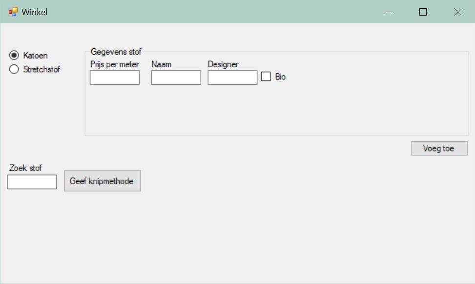
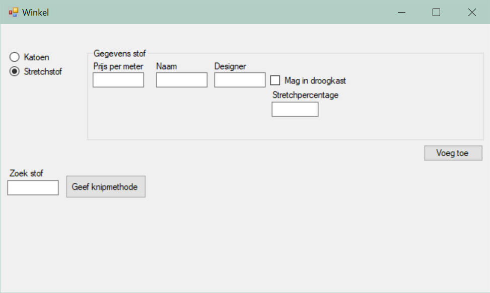
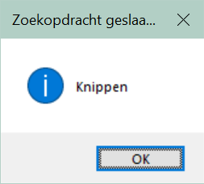
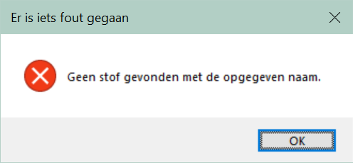

# Les 1

## Oefening 1

### Klasse Program

```csharp
class Program
    {
        static void Main(string[] args)
        {
            Stof stof = new Stof(10, "test", "test");
            Stof stof1 = new Stof(10, 2, "test", "test", Kwaliteitslabels.A);
            Stof stof2 = new Stretchstof(10, 4, "stof2", "test", Kwaliteitslabels.B, 20, true);
            Stof stof3 = new Katoen(10, "stof3", "test", true);
            Console.WriteLine($"{stof}\n\n{stof1}\n\n{stof2}\n\n{stof3}");
        }
    }
```

### Klasse Stof

```csharp
enum Kwaliteitslabels { A, B, C, Onbekend}
class Stof
{
    public decimal PrijsPerMeter { get; set; }
    public decimal KrimpPercentage { get; set; }
    public string Naam { get; set; }
    public string Designer { get; set; }
    public Kwaliteitslabels Kwaliteitslabel { get; set; }

    public Stof(decimal prijsPerMeter, decimal krimpPercentage, string naam, string designer, Kwaliteitslabels kwaliteitslabel)
    {
        PrijsPerMeter = prijsPerMeter;
        KrimpPercentage = krimpPercentage;
        Naam = naam;
        Designer = designer;
        Kwaliteitslabel = kwaliteitslabel;
    }
    public Stof(decimal prijsPerMeter, string naam, string designer) :this(prijsPerMeter, -1/*Je kan hier ook een standaardwaarde geven, zoals ik in oefening 6 doe*/, naam, designer, Kwaliteitslabels.Onbekend/*Zelfde als bij -1*/)
    {

    }

    public override string ToString()
    {
        StringBuilder result = new StringBuilder();
        if (KrimpPercentage != -1)
            result.Append($"Prijs per meter: {PrijsPerMeter}\nKrimp percentage: {KrimpPercentage}");
        else
            result.Append($"Prijs per meter: {PrijsPerMeter}");
        result.Append($"\nNaam: {Naam}\nDesigner: {Designer}\nKwaliteitslabel: {Kwaliteitslabel}");
        return result.ToString();
    }
}
```

### Klasse Stretchstof

```csharp
class Stretchstof : Stof
{
    public decimal Stretchpercentage { get; set; }
    public bool MagInDroogkast { get; set; }
    public Stretchstof(decimal prijsPerMeter, string naam, string designer, decimal stretchpercentage, bool magInDroogkast) : base(prijsPerMeter, naam, designer)
    {//Deze body kan leeg zijn als je overloadt naar "this" in plaats van "base". (zie oefening 6)
        Stretchpercentage = stretchpercentage;
        MagInDroogkast = magInDroogkast;
    }

    public Stretchstof(decimal prijsPerMeter, decimal krimpPercentage, string naam, string designer, Kwaliteitslabels kwaliteitslabel, decimal stretchpercentage, bool magInDroogkast) : base(prijsPerMeter, krimpPercentage, naam, designer, kwaliteitslabel)
    {
        Stretchpercentage = stretchpercentage;
        MagInDroogkast = magInDroogkast;
    }

    public override string ToString()
    {
        string droogkast = MagInDroogkast ? "Deze stof mag in de droogkast" : "Deze stof mag niet in de droogkast";
        return base.ToString() + $"\nStretchpercentage: {Stretchpercentage}\n{droogkast}";
    }
}
```

### Klasse Katoen

```csharp
internal class Katoen : Stof
{
    public bool Bio { get; set; }
    public Katoen(decimal prijsPerMeter, string naam, string designer, bool bio) : base(prijsPerMeter, naam, designer)
    {
        Bio = bio;
    }

    public Katoen(decimal prijsPerMeter, decimal krimpPercentage, string naam, string designer, Kwaliteitslabels kwaliteitslabel, bool bio) : base(prijsPerMeter, krimpPercentage, naam, designer, kwaliteitslabel)
    {
        Bio = bio;
    }

    public override string ToString()
    {
        string bio = Bio ? "Biologisch" : "Niet biologisch";
        return base.ToString() + $"\n{bio}";
    }
}
```

## Oefening 2

### Klasse Program

```csharp
class Program
    {
        static void Main(string[] args)
        {
            Winkel winkel = new Winkel();
            Stof stof = new Stof(10, "test", "test");
            Stof stof1 = new Stof(10, 2, "test", "test", Kwaliteitslabels.A);
            Stof stof2 = new Stretchstof(10, 4, "stof2", "test", Kwaliteitslabels.B, 20, true);
            Stof stof3 = new Katoen(10, "stof3", "test", true);

            winkel.VoegStofToe(stof);
            winkel.VoegStofToe(stof1);
            winkel.VoegStofToe(stof2);
            winkel.VoegStofToe(stof3);
            winkel.VerwijderStof(stof);
            Console.WriteLine(winkel);
        }
    }
```

### Klasse Winkel

```csharp
class Winkel
{
    private List<Stof> stoffen;

    public Winkel()
    {
        stoffen = new List<Stof>();
    }

    public bool VoegStofToe(Stof stof)
    {
        stoffen.Add(stof);
        return true;
    }

    public bool VerwijderStof(Stof stof)
    {
        return stoffen.Remove(stof);
    }

    private string Stoffen()
    {
        StringBuilder result = new StringBuilder();
        foreach(Stof stof in stoffen)
        {
            result.Append($"{stof}\n\n");
        }
        return result.ToString();
    }

    public override string ToString()
    {
        return $"De winkel heeft de volgende stoffen:\n\n{Stoffen()}";
    }
}
```

### Klasse Stof, Stretchstof en Katoen

Blijven hetzelfde als in oefening 1

## Oefening 3

Gewoon in uw ToString-method plaatsen, is al gebeurd in oefening 1.

## Oefening 4

### Klasse Program

Zelfde als in oefening 2

### Klasse Stof

```csharp
enum Kwaliteitslabels { A, B, C, Onbekend}
class Stof
{
    public decimal PrijsPerMeter { get; set; }
    public decimal KrimpPercentage { get; set; }
    public string Naam { get; set; }
    public string Designer { get; set; }
    public Kwaliteitslabels Kwaliteitslabel { get; set; }

    public Stof(decimal prijsPerMeter, decimal krimpPercentage, string naam, string designer, Kwaliteitslabels kwaliteitslabel)
    {
        PrijsPerMeter = prijsPerMeter;
        KrimpPercentage = krimpPercentage;
        Naam = naam;
        Designer = designer;
        Kwaliteitslabel = kwaliteitslabel;
    }
    public Stof(decimal prijsPerMeter, string naam, string designer) :this(prijsPerMeter, -1, naam, designer, Kwaliteitslabels.Onbekend)
    {

    }

    public virtual string Inkorten()
    {
        return "Geen knipmethode gedefinieerd";
    }

    public override string ToString()
    {
        StringBuilder result = new StringBuilder();
        if (KrimpPercentage != -1)
            result.Append($"Prijs per meter: {PrijsPerMeter}\nKrimp percentage: {KrimpPercentage}");
        else
            result.Append($"Prijs per meter: {PrijsPerMeter}");
        result.Append($"\nNaam: {Naam}\nDesigner: {Designer}\nKwaliteitslabel: {Kwaliteitslabel}\nKnipmethode: {Inkorten()}");
        return result.ToString();
    }
}
```

### Klasse Stretchstof

```csharp
class Stretchstof : Stof
{
    public decimal Stretchpercentage { get; set; }
    public bool MagInDroogkast { get; set; }
    public Stretchstof(decimal prijsPerMeter, string naam, string designer, decimal stretchpercentage, bool magInDroogkast) : base(prijsPerMeter, naam, designer)
    {
        Stretchpercentage = stretchpercentage;
        MagInDroogkast = magInDroogkast;
    }

    public Stretchstof(decimal prijsPerMeter, decimal krimpPercentage, string naam, string designer, Kwaliteitslabels kwaliteitslabel, decimal stretchpercentage, bool magInDroogkast) : base(prijsPerMeter, krimpPercentage, naam, designer, kwaliteitslabel)
    {
        Stretchpercentage = stretchpercentage;
        MagInDroogkast = magInDroogkast;
    }

    public override string Inkorten()
    {
        return Knippen();
    }

    public string Knippen()//Aangezien je ook gewoon aan deze methode moet kunnen van bovenaf is dit public.
    {
        return "Knippen";
    }

    public override string ToString()
    {
        string droogkast = MagInDroogkast ? "Deze stof mag in de droogkast" : "Deze stof mag niet in de droogkast";
        return base.ToString() + $"\nStretchpercentage: {Stretchpercentage}\n{droogkast}";
    }
}
```

### Klasse Katoen

```csharp
internal class Katoen : Stof
{
    public bool Bio { get; set; }
    public Katoen(decimal prijsPerMeter, string naam, string designer, bool bio) : base(prijsPerMeter, naam, designer)
    {
        Bio = bio;
    }

    public Katoen(decimal prijsPerMeter, decimal krimpPercentage, string naam, string designer, Kwaliteitslabels kwaliteitslabel, bool bio) : base(prijsPerMeter, krimpPercentage, naam, designer, kwaliteitslabel)
    {
        Bio = bio;
    }

    public override string Inkorten()
    {
        return Scheuren();
    }

    public string Scheuren()//Aangezien je ook gewoon aan deze methode moet kunnen van bovenaf is dit public.
    {
        return "Scheuren";
    }
    public override string ToString()
    {
        string bio = Bio ? "Biologisch" : "Niet biologisch";
        return base.ToString() + $"\n{bio}";
    }
}
```

## Oefening 5 & 6









### Klasse Form1

```csharp
public partial class Form1 : Form
{
    Winkel winkel;
    public Form1()
    {
        InitializeComponent();
        winkel = new Winkel();
    }

    private void CheckedChanged(object sender, EventArgs e)
    {
        ChangeVisibility(radioButtonKatoen.Checked);
    }

    /// <summary>
    /// Verandert de zichtbaarheid van de speciale velden
    /// </summary>
    /// <param name="katoen">True om katoenvelden zichtbaar te maken, false om stretchstofvelden zichtbaar te maken</param>
    private void ChangeVisibility(bool katoen)
    {
        panelKatoen.Visible = katoen;
        panelStretchstof.Visible = !katoen;
    }

    private void ClearGroupBox()
    {
        foreach(TextBox textBox in groupBoxGegevensStof.Controls.OfType<TextBox>())
        {
            textBox.Clear();
        }
    }

    private void ButtonVoegToe_Click(object sender, EventArgs e)
    {
        if (radioButtonKatoen.Checked)
            winkel.VoegStofToe(new Katoen(decimal.Parse(textBoxPrijsPerMeter.Text), textBoxNaam.Text, textBoxDesigner.Text, checkBoxBio.Checked));
        else
            winkel.VoegStofToe(new Stretchstof(decimal.Parse(textBoxPrijsPerMeter.Text), textBoxNaam.Text, textBoxDesigner.Text, decimal.Parse(textBoxStretchpercentage.Text), checkBoxMagInDroogkast.Checked));
        ClearGroupBox();
    }

    private void ButtonZoekStof_Click(object sender, EventArgs e)
    {
        if (winkel.GeefKnipMethode(textBoxZoekStof.Text, out string bericht))
            MessageBox.Show(bericht, "Zoekopdracht geslaagd", MessageBoxButtons.OK, MessageBoxIcon.Information);
        else
            MessageBox.Show(bericht, "Er is iets fout gegaan", MessageBoxButtons.OK, MessageBoxIcon.Error);
    }
}
```

### Klasse Winkel

```csharp
class Winkel
{
    private List<Stof> stoffen;

    public Winkel()
    {
        stoffen = new List<Stof>();
    }

    public bool VoegStofToe(Stof stof)
    {
        stoffen.Add(stof);
        return true;
    }

    public bool VerwijderStof(Stof stof)
    {
        return stoffen.Remove(stof);
    }

    public bool GeefKnipMethode(string naam, out string bericht)
    {
        foreach (Stof stof in stoffen)
        {
            if (stof.Naam == naam)
            {
                bericht = stof.Inkorten();
                return true;
            }
        }
        bericht = "Geen stof gevonden met de opgegeven naam.";
        return false;
    }


    private string Stoffen()
    {
        StringBuilder result = new StringBuilder();
        foreach(Stof stof in stoffen)
        {
            result.Append($"{stof}\n\n");
        }
        return result.ToString();
    }

    public override string ToString()
    {
        return $"De winkel heeft de volgende stoffen:\n\n{Stoffen()}";
    }
}
```

### Klasse Stof, Stretchstof en Katoen

In principe zijn deze alledrie hetzelfde als in oefening 4, maar ik heb echter een aantal code-verbeteringen toegevoegd.

### Klasse Stof

```csharp
enum Kwaliteitslabels { A, B, C }
    class Stof
    {
        public decimal PrijsPerMeter { get; set; }
        public decimal KrimpPercentage { get; set; }
        public string Naam { get; set; }
        public string Designer { get; set; }
        public Kwaliteitslabels Kwaliteitslabel { get; set; }

        public Stof(decimal prijsPerMeter, decimal krimpPercentage, string naam, string designer, Kwaliteitslabels kwaliteitslabel)
        {
            PrijsPerMeter = prijsPerMeter;
            KrimpPercentage = krimpPercentage;
            Naam = naam;
            Designer = designer;
            Kwaliteitslabel = kwaliteitslabel;
        }
        public Stof(decimal prijsPerMeter, string naam, string designer) :this(prijsPerMeter, 1, naam, designer, Kwaliteitslabels.C)
        {

        }

        public virtual string Inkorten()
        {
            return "Geen knipmethode gedefinieerd";
        }

        public override string ToString()
        {
            return $"Prijs per meter: {PrijsPerMeter:C}\nNaam: {Naam}\nDesigner: {Designer}\nKwaliteitslabel: {Kwaliteitslabel}\nKnipmethode: {Inkorten()}";
        }
    }
```

### Klasse Stretchstof

```csharp
class Stretchstof : Stof
    {
        public decimal Stretchpercentage { get; set; }
        public bool MagInDroogkast { get; set; }

        public Stretchstof(decimal prijsPerMeter, decimal krimpPercentage, string naam, string designer, Kwaliteitslabels kwaliteitslabel, decimal stretchpercentage, bool magInDroogkast) : base(prijsPerMeter, krimpPercentage, naam, designer, kwaliteitslabel)
        {
            Stretchpercentage = stretchpercentage;
            MagInDroogkast = magInDroogkast;
        }
        public Stretchstof(decimal prijsPerMeter, string naam, string designer, decimal stretchpercentage, bool magInDroogkast) : this(prijsPerMeter, 1, naam, designer, Kwaliteitslabels.B, stretchpercentage, magInDroogkast)
        {
        }
        public override string Inkorten()
        {
            return Knippen();
        }

        public string Knippen()
        {
            return "Knippen";
        }

        public override string ToString()
        {
            return base.ToString() + $"\nStretchpercentage: {Stretchpercentage:P}\n{(MagInDroogkast ? "Deze stof mag in de droogkast" : "Deze stof mag niet in de droogkast")}";
        }
    }
```

### Klasse Katoen

```csharp
internal class Katoen : Stof
    {
        public bool IsBio { get; set; }

        public Katoen(decimal prijsPerMeter, decimal krimpPercentage, string naam, string designer, Kwaliteitslabels kwaliteitslabel, bool isBio) : base(prijsPerMeter, krimpPercentage, naam, designer, kwaliteitslabel)
        {
            IsBio = isBio;
        }
        public Katoen(decimal prijsPerMeter, string naam, string designer, bool isBio) : this(prijsPerMeter, 0, naam, designer, Kwaliteitslabels.A, isBio)
        {

        }

        public override string Inkorten()
        {
            return Scheuren();
        }

        public string Scheuren()
        {
            return "Scheuren";
        }
        public override string ToString()
        {
            return base.ToString() + $"\n{(IsBio ? "Biologisch" : "Niet biologisch")}";
        }
    }
```
