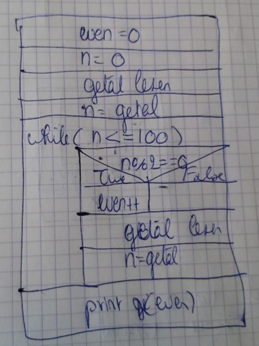
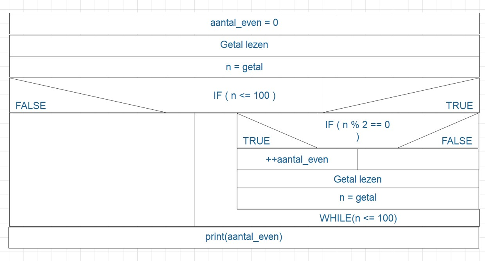
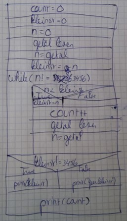
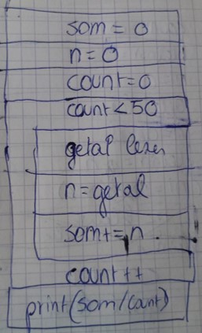
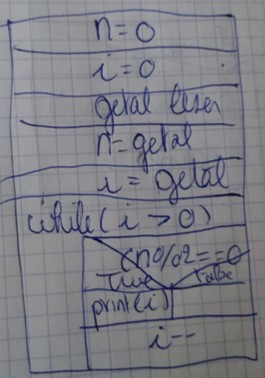

# Nassishneiderman

> Als je het niet kan lezen, stuur een DM naar Dana.

## Easy

1) Je krijgt een getal binnen. Als het 100 is, laat je “D” zien, als het 120 is “C” en als het 140 is “B”. Als het een ander getal is “A”.

2) Begin bij 1 en tel er telkens 1 bij op tot je 10 komt (dus zonder 10). Toon telkens de nieuwe waarde die je hebt gekregen.

3) Lees een willekeurig aantal getallen in met als afsluitwaarde 32786. Bereken de som en druk die af.
3

## Gevorderd

1) Lees een willekeurig aantal getallen in en stop direct als de waarde groter is dan 100. Druk het aantal even getallen af dat je bent tegengekomen.

2) Zou je een willekeurige WHILE-DO door een do-while kunnen vervangen? Verklaar.

> Ja dit kan

3) Lees een willekeurig aantal getallen in met als afsluitwaarde 3456. Druk het kleinste getal af en hoeveel getallen we al hebben bekeken.

4) Druk het gemiddelde af van 50 in te lezen getallen.

5) Druk alle delers af van een in te lezen getal. Het in te lezen getal moet positief zijn.

