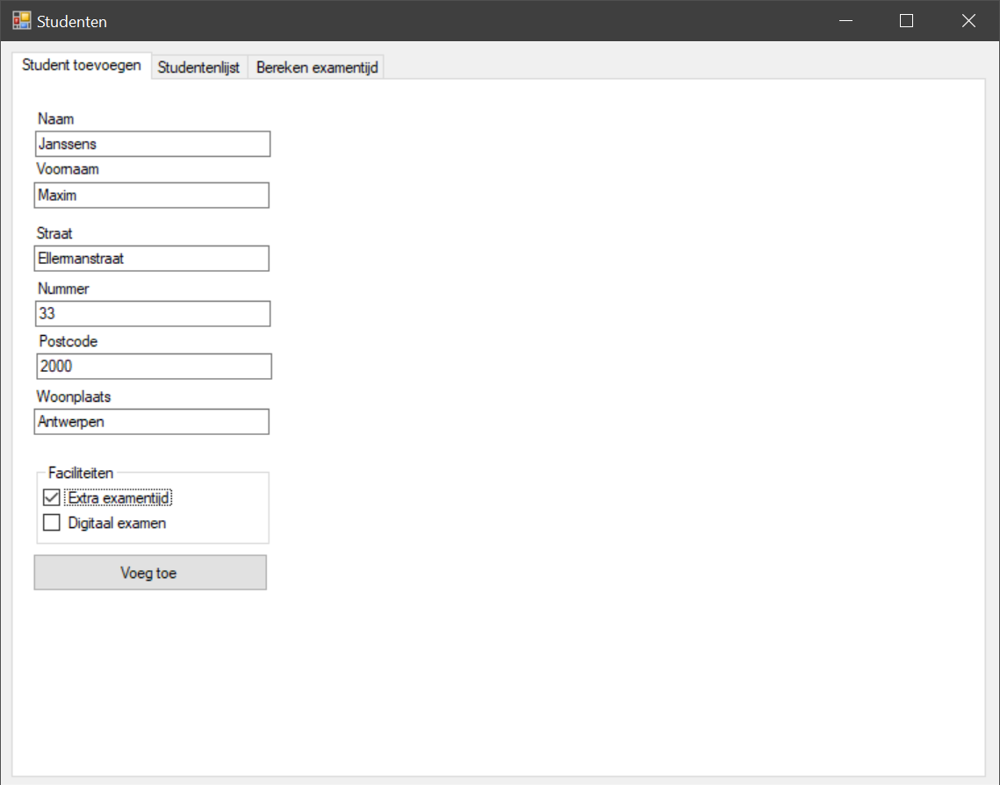
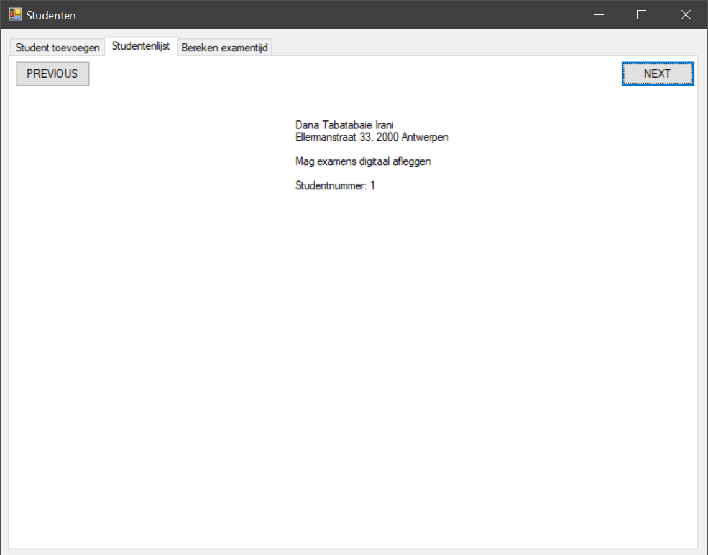
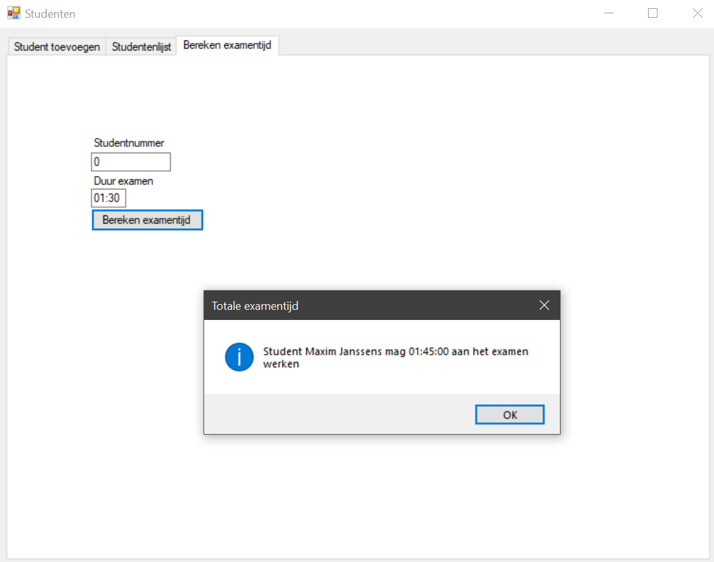

# Les 5

## Oefening 1







### Klasse Form1

```csharp
    public partial class Form1 : Form
    {
        private List<Student> studenten;
        int huidigGeselecteerd = 0;
        public Form1()
        {
            InitializeComponent();
            studenten = new List<Student>();
        }

        private void ButtonVoegToe_Click(object sender, EventArgs e)
        {
            try
            {
                Student student = new Student(textBoxNaam.Text, textBoxVoornaam.Text, new Adres(textBoxStraat.Text, textBoxNummer.Text, textBoxPostcode.Text, textBoxWoonplaats.Text), checkBoxExtraExamentijd.Checked, checkBoxDigitaalExamen.Checked);
                studenten.Add(student);
                LaadStudentInfo(false);
                foreach (TextBox textBox in tabControlKeuze.TabPages["tabPageVoegStudentToe"].Controls.OfType<TextBox>())
                    textBox.Clear();
                checkBoxDigitaalExamen.Checked = false;
                checkBoxExtraExamentijd.Checked = false;
            }
            catch (InvalidCharactersException ex)
            {
                MessageBox.Show(ex.Message, "Foutje!", MessageBoxButtons.OK, MessageBoxIcon.Error);
            }
        }


        private void LaadStudentInfo(bool volgende)
        {
            if (volgende)
                huidigGeselecteerd++;
            else
                huidigGeselecteerd--;
            if (huidigGeselecteerd < 0)
                huidigGeselecteerd = studenten.Count - 1;
            huidigGeselecteerd %= studenten.Count;
            labelStudentInfo.Text = $"{studenten.ElementAt(huidigGeselecteerd)}";
            labelStudentInfo.Text += $"\n\nStudentnummer: {huidigGeselecteerd}";
        }

        private void ButtonNext_Click(object sender, EventArgs e)
        {
            LaadStudentInfo(true);
        }

        private void ButtonPrevious_Click(object sender, EventArgs e)
        {
            LaadStudentInfo(false);
        }

        private void ButtonExamenTijd_Click(object sender, EventArgs e)
        {
            try
            {
                Student geselecteerdeStudent = (Student)studenten.ElementAt(int.Parse(textBoxStudentNummer.Text));
                TimeSpan examenDuur = TimeSpan.Parse(maskedTextBoxDuurExamen.Text);
                MessageBox.Show($"Student {geselecteerdeStudent.Voornaam} {geselecteerdeStudent.Naam} mag {(geselecteerdeStudent.ExtraExamentijd ? (examenDuur < new TimeSpan(2, 0, 0) ? examenDuur.Add(new TimeSpan(0, 15, 0)) : examenDuur.Add(new TimeSpan(0, 30, 0))) : examenDuur)} aan het examen werken", "Totale examentijd", MessageBoxButtons.OK, MessageBoxIcon.Information);
            }
            catch (ArgumentOutOfRangeException)
            {
                MessageBox.Show("Opgegeven studentnummer bestaat niet.", "Error", MessageBoxButtons.OK, MessageBoxIcon.Error);
            }
            catch (FormatException ex)
            {
                MessageBox.Show(ex.Message, "Error", MessageBoxButtons.OK, MessageBoxIcon.Warning);
            }

        }
    }
```

### Klasse Student

```csharp
    class Student
    {
        public string Naam { get; set; }
        public string Voornaam { get; set; }
        public Adres Adres { get; set; }
        public bool ExtraExamentijd { get; set; }
        public bool DigitaalExamen { get; set; }

        public Student(string naam, string voornaam, Adres adres, bool extraExamentijd, bool digitaalExamen)
        {
            if (Regex.IsMatch(naam, "_|@|\\\\") || Regex.IsMatch(voornaam, "_|@|\\\\"))
                throw new InvalidCharactersException("naam of voornaam");
            Naam = naam;
            Voornaam = voornaam;
            Adres = adres;
            ExtraExamentijd = extraExamentijd;
            DigitaalExamen = digitaalExamen;
        }

        public override string ToString()
        {
            return $"{Voornaam} {Naam}\n{Adres}\n{(ExtraExamentijd ? "Heeft extra examentijd." : "")}\n{(DigitaalExamen ? "Mag examens digitaal afleggen" : "")}";
        }
    }
```

### Klasse Adres

```csharp
    class Adres
    {
        public string Straat { get; set; }
        public string Nummer { get; set; }
        public string Postcode { get; set; }
        public string Woonplaats { get; set; }

        public Adres(string straat, string nummer, string postcode, string woonplaats)
        {
            if (Regex.IsMatch(straat, "@|_|\\\\"))
                throw new InvalidCharactersException("straat van het adres");
            else if (Regex.IsMatch(woonplaats, "@|_|\\\\"))
                throw new InvalidCharactersException("woonplaats van het adres");
            Straat = straat;
            Nummer = nummer;
            Postcode = postcode;
            Woonplaats = woonplaats;
        }

        public override string ToString()
        {
            return $"{Straat} {Nummer}, {Postcode} {Woonplaats}";
        }
    }
```

### Klasse InvalidCharactersException

```csharp
    class InvalidCharactersException : Exception
    {
        public InvalidCharactersException(string plaatsFout) : base($"ERROR [{DateTime.Now}] : De student die je probeerde aan te maken heeft speciale karakters in {plaatsFout}. Pas aan en probeer opnieuw.")
        {
        }
    }
```
