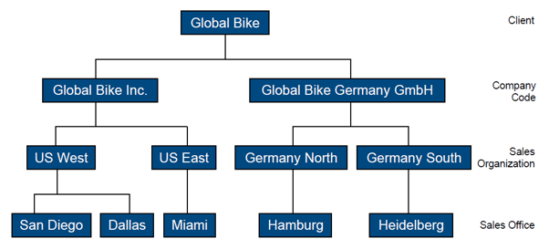
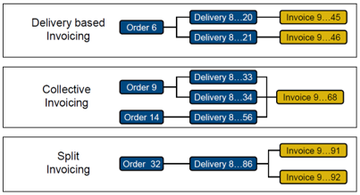

# Sales & Distribution (SD)
## Organizational structure
Sales Area
- Combination of Sales Organization, Distribution Channel and Division
- Determines conditions (i.e. pricing) for sales activities

## Master Data:
- Customer master, Material master, Sales condition
    - Customer master data
        - Data needed for orders, deliveries, invoices and payment
        - General data, company code data, sales area data
    - Material master data
        - Purchasing data, forecasting data, quality data, accounting data, storage data…
    - Condition master data
        - Prices, surcharges, discounts, freights, taxes … (material / customer specific)

- Sales order process
> Pre-sales activities -> sales order entry -> check availability -> pick materials -> pack materials -> post goods issue -> invoice customer -> receipt of customer payment

<b>Pre-sales activities</b>

Sales support
- Keep track of customer contacts
- Get data of past actions with the customer: 360° view
- Inquiries (vraag om informatie / offerte vragen) & quotations (voorstel)

## Sales order
- Header
    - Customer data, total cost of the order
- Line Item(s)
    - Material and quantity, cost of an individual line
- Schedule Line(s)
    - Uniquely for Line Item: quantities and dates deliveries
    - Shipping information (route determination)
    - Billing Information

- Scheduling:
	- Delivery date per Line item
	- Delivery timeline
    	- Backward scheduling: wanneer nodig? hoe lang duurt het? dan moeten we zoveel dagen op voorhand beginnen.
        - Forward scheduling: wanneer hebben we het materiaal? hoe lang duurt de rest van het proces? Wanneer kunnen we dan leveren?
	- ATP: Availability to Promise

- Shipping: start + end point, route, transit time
- Availability check: when materials available? (consider all inventory movements)

- Pricing: systeem zoekt automatisch naar gegevens, zowel totaalprijs in header als prijs per eenheid bij het Line item
- Credit check: systeem kijkt credit situation van klanten na (op betrouwbaarheid) en kan wanneer ingesteld zelf orders en deliveries blokkeren.

## Documents
- Shipping document: picking, packing, post goods issue
    - Integrated with Material Management, extended Warehouse Management and Finance

- Delivery creation: 
    - Checks if delivery is possible:
        - Availability
        - Export/foreign trade requirements
        - Total weight & volume
    - Generates packing proposal
    - Updates sales order

- Delivery document: picking, packing, loading, posting goods issue

- Picking: quantities based on delivery note, where and when to pick, lot number tracking

- Loading and packing: packaging, weight/volume restrictions

- Goods issue: (can) change legal ownership of products, inventory reduces

- Billing: generate customer invoice
    - Debit to ledger, credit to revenue

- Payment: Finance
    - Vergelijk invoice en payment
    - Increases bank account
- Document flow: follow up status of order
- List of sales orders: VA05

## SAP S/4HANA
- Business Partner = single point of entry for master data about persons (customer, vendor…)
    - Organisation: company, department, association...
    - Group: living arrangement, married couple...
- Credit management necessary 
- SD Analytics <b>simplified = core function</b>
- Traditional ERP had redundant objects
- Credit management: identify risk of loss of receivables
    - for companies with many business partners
- Analyses: ODATA & Open CDS