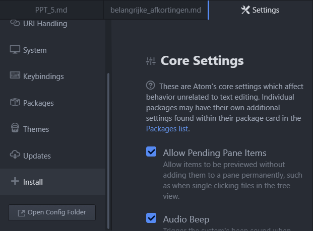
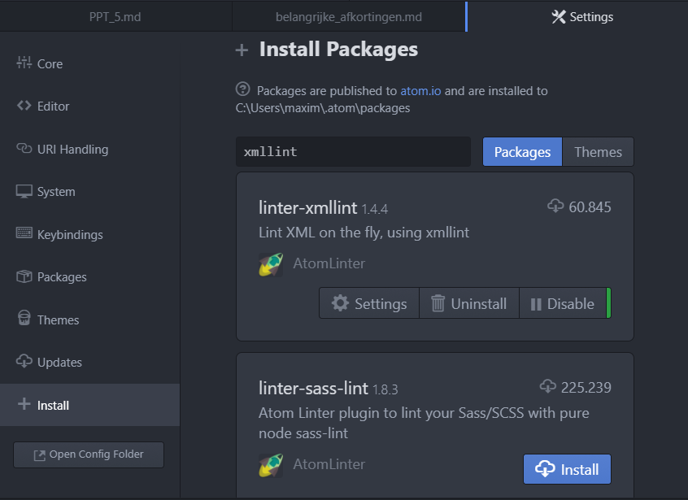
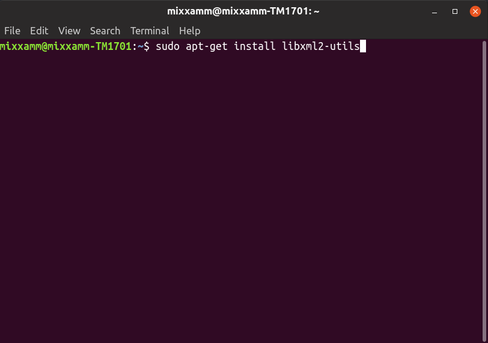
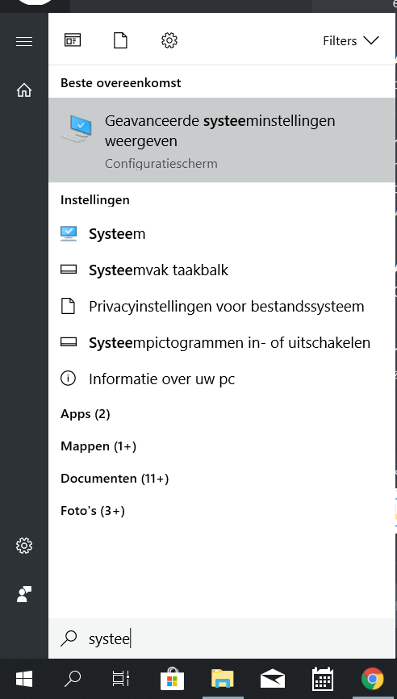
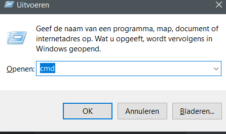
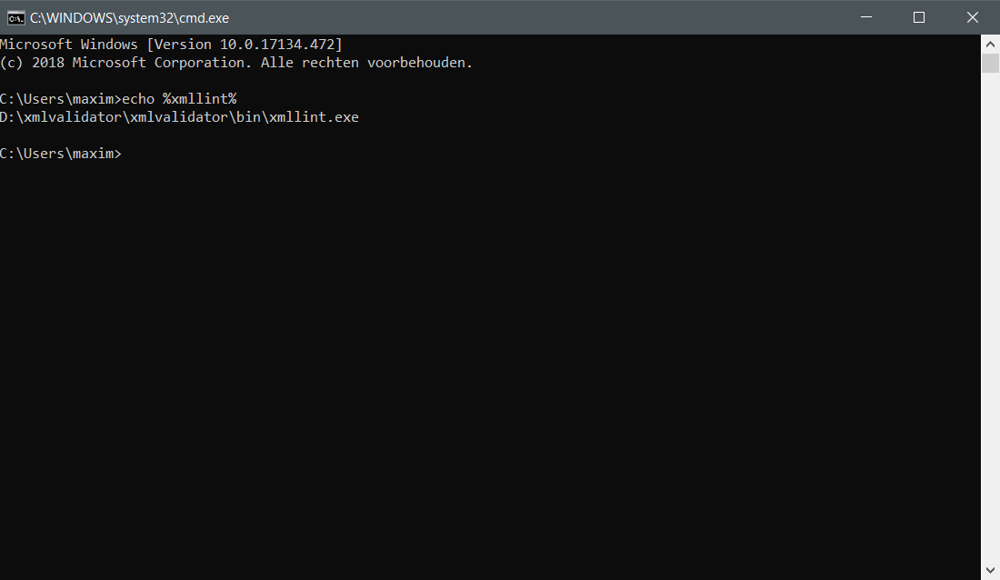
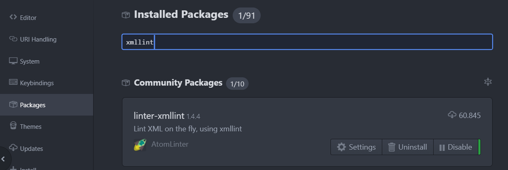
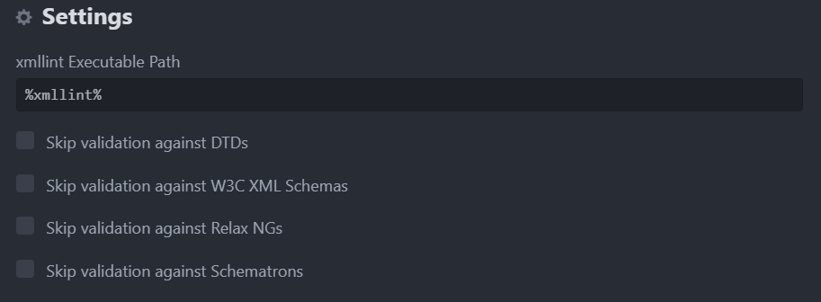
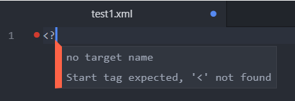

# XML-linter in Atom
## Stap 1
Open Atom en open de instellingen via de toetsencombinatie `ctrl` + `,` om de instellingen te openen. Druk vervolgens op `install`

Type `xmllint` in de zoekbalk en installeer het eerste zoekresultaat

Nadat de installatie is geslaagd krijg je normaalgezien rechtsboven de vraag of je verschillende andere packages wilt installeren
die nodig zijn om linter-xmllint te laten werken. Druk telkens op `Yes`.

## Stap 2
De tweede stap verschilt van besturingssysteem tot besturingssysteem.

### MacOS
Je hoeft niets extra te doen, het zou meteen moeten werken.

### Linux
Open de terminal(`ctrl` + `alt` + `t`) en type het volgende commando:
`sudo apt-get install libxml2-utils`

Druk op enter om uit te voeren.

### Windows
Download [dit bestand](https://www.dropbox.com/s/xyhecziybkxlh8u/xmlvalidator.zip?dl=0)

Pak het ergens uit en navigeer vervolgens naar de `bin`-map.

Kopier het PATH en open systeeminstellingen

Druk nu op Omgevingsvariabelen

Maak een omgevingsvariabele aan met de naam `xmllint`. BELANGRIJK: vergeet achter het PATH dat je erin plakt niet om `\xmllint.exe` te schrijven!
Het zou er ongeveer zo moeten uitzien:

Om te checken of we onze omgevingsvariabele succesvol hebben aangemaakt, open we de command prompt. Dit doen we door op de `windows`-toets +  `r` te drukken. In het schermpje dat verschijnt typen we `cmd`.

Er opent nu een zwart scherm. Hierin typen we `echo %xmllint%`. Als dit het juiste PATH weergeeft kunnen we verder.

We openen terug de settings op Atom met behulp van de sneltoets `ctrl` + `,`.
Vervolgens klikken we op packages en typen we `xmllint`, hier drukken we op `settings`.

Helemaal vanboven in de instellingen typen we in het vakje voor xml Executable Path `%xmllint%`

Sluit Atom en open het opnieuw. Maak nu een nieuw xml-bestand aan en begin te typen `<?`.
Normaalgezien zie je nu een rood bolletje aan het begin van het eerste lijntje.

Indien je problemen hebt, roep me maar op discord @mixxamm.
