# Les 5
## Oefening 5.1
Om te beginnen; zorg ervoor dat je Toolbox zichtbaar is. Standaard is dit niet het geval, zoals in onderstaand screenshot

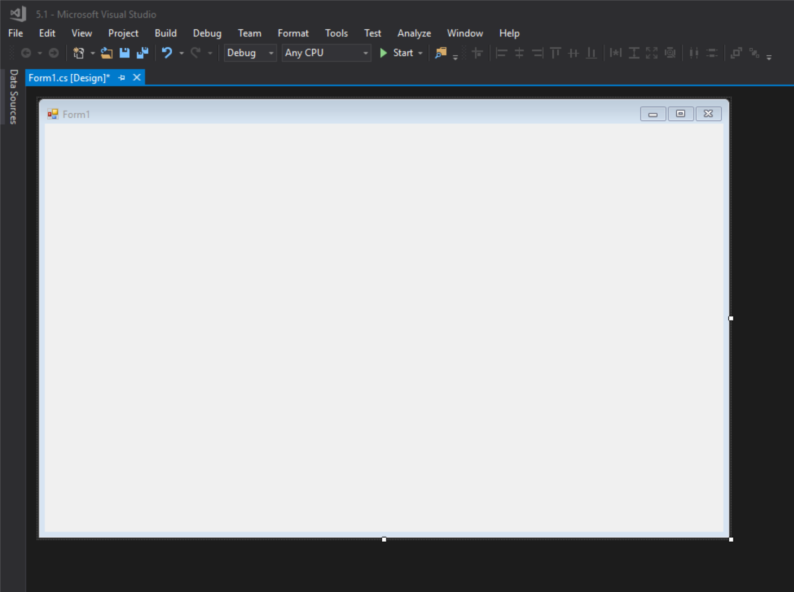

Om de Toolbox te openen, maak je gebruik van de sneltoets `ctrl` + `alt` + `x`.
Je kan deze dan ook vastpinnen door op de pinknop te drukken.


Sleep nu een Button uit de Toolbox naar de Form. Eens dit gebeurd is kan je de naam en andere eigenschappen ervan aanpassen. Dit doe je rechtsonder;

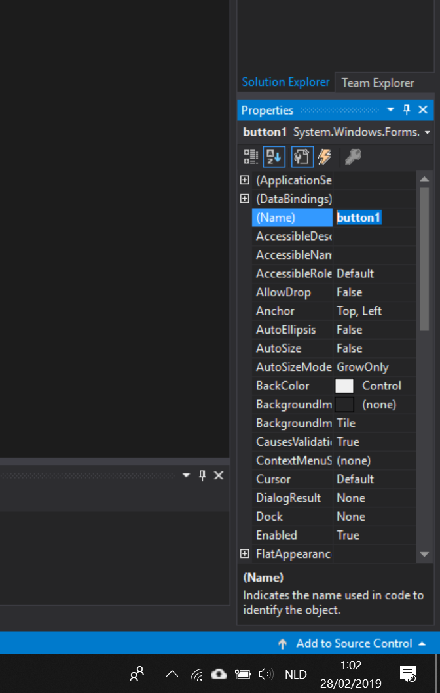

De tekst die op de knop zelf staat kan je aanpassen als je naar onder scrollt, en zoekt achter de property `Text`.

Sleep nu ook een Label vanuit de Toolbox naar de Form en pas hiervan ook de naam aan. Maak ook de `Text`-property leeg.

Als je het programma start, zou dat er ongeveer zo moeten uitzien;


Maar dan zonder het Saldo, want de code daarvoor moeten we nog aanmaken.

#### De code
### Klasse Program
Hebben we voor het eerst gewoon standaard gelaten.
### Klasse Dobbelspel (Form1.cs)
Opgelet: dit is enkel het code-deel van de klasse (daarvan partial class). Het design-deel wordt automatisch aangemaakt door Visual Studio en daar blijven we af.
```csharp
public partial class Dobbelspel : Form
    {
        private const decimal START_GELD = 100.00m;
        private Geld geld;
        private Dobbelsteen dobbelsteen;
        public Dobbelspel()
        {
            InitializeComponent();
            geld = new Geld(START_GELD);
            labelSaldo.Text = geld.ToString();//ToString-methode moet omdat de Text-property een string verwacht
            dobbelsteen = new Dobbelsteen();
        }

        private void KnopGooi_Click(object sender, EventArgs e)
        {
            int worp = dobbelsteen.Gooi();
            pictureBox1.Image = Image.FromFile(@"../../afbeeldingen/" + worp + ".png");
            if (geld.PasSaldoAan(worp) && geld.Saldo != 0)
                labelSaldo.Text = $"U hebt {worp} gegooid. {geld.ToString()}";
            else
            {
                labelSaldo.Text = "Geld is op.";
                KnopGooi.Enabled = false;
            }
        }
    }
```
### Klasse Geld
```csharp
internal class Geld
    {
        public decimal Saldo { get; set; }

        public Geld(decimal saldo)
        {
            Saldo = saldo;
        }

        public bool PasSaldoAan(int aantal)
        {
            decimal aanpassing;
            switch (aantal)
            {
                case 1:
                    aanpassing = 20;
                    break;
                case 6:
                    aanpassing = 15;
                    break;
                default:
                    aanpassing = -10;
                    break;
            }
            if (Saldo + aanpassing < 0)
                return false;
            Saldo += aanpassing;
            return true;
        }

        public override string ToString()
        {
            return $"Huidig saldo: {Saldo}";
        }
    }
```
### Klasse Dobbelsteen
```csharp
class Dobbelsteen
    {
        static Random random = new Random();
        public int Gooi()
        {
            return random.Next(1, 7);
        }
    }
```
Het uiteindelijke resultaat zou er ongeveer zo moeten uitzien;

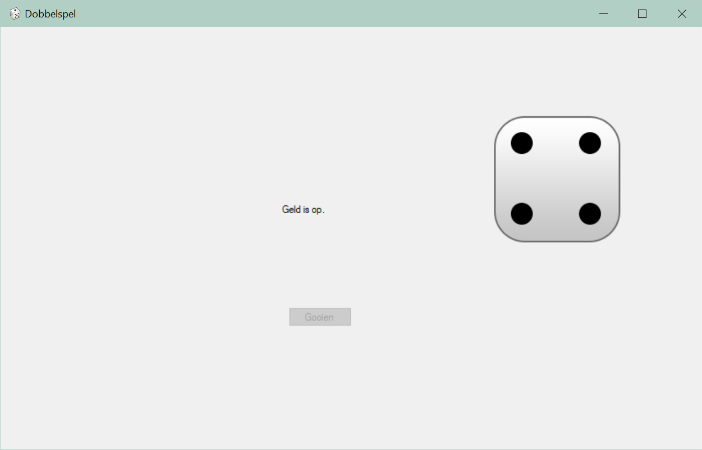

#### Nieuw:
[WPF-versie](les5wpf.md) van deze oefening

## Oefening 5.2
Maak gebruik van Knoppen, Een Textbox en een Label om het programma er als volgt uit te laten zien;

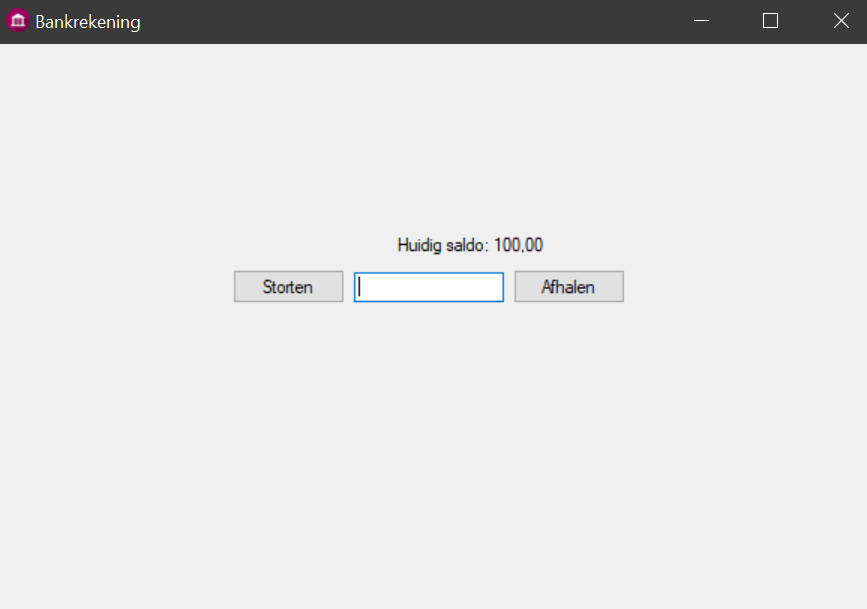

### Klasse Bank (Form1.cs)
```csharp
public partial class Bank : Form
{
    Bankrekening bankrekening;
    public Bank()
    {
        InitializeComponent();
        bankrekening = new Bankrekening(100.00m);
        UpdateSaldo();
    }


    private void KnopStorten_Click(object sender, EventArgs e)
    {
        bankrekening.WijzigSaldo(decimal.Parse(textBoxHoeveelheid.Text));
        UpdateSaldo();
    }

    private void KnopAfhalen_Click(object sender, EventArgs e)
    {
        bankrekening.WijzigSaldo(-decimal.Parse(textBoxHoeveelheid.Text));
        UpdateSaldo();
    }

    private void UpdateSaldo()
    {
        if (bankrekening.Saldo < 0)
        {
            labelSaldo.ForeColor = Color.Red;
            MessageBox.Show("Je bankrekening staat negatief!", "Opgelet!", MessageBoxButtons.OK);
        }

        else
            labelSaldo.ForeColor = Color.Black;
        labelSaldo.Text = bankrekening.ToString();//Iemand die weet waarom ik hier .ToString() moet doen? Pls leg uit thanks
    }
}
```
De `MessageBox` zorgt ervoor dat er een melding wordt getoond aan de gebruiker als zijn bankrekening negatief staat. Het zou er ongeveer zo moeten uitzien;

### Klasse Bankrekening
```csharp
class Bankrekening
    {
        public decimal Saldo { get; private set; }
        public Bankrekening(decimal saldo)
        {
            Saldo = saldo;
        }

        public void WijzigSaldo(decimal hoeveelheid)
        {
            Saldo += hoeveelheid;
        }

        public override string ToString()
        {
            return $"Huidig saldo: {Saldo}";
        }
    }
```
## Oefening 5.3
Bij alle oefeningen hiervoor was het maken van een layout nog redelijk simpel. Nu komt er echter een extra moeilijkheidsgraad. Je moet namelijk verschillende elementen verbergen of tonen afhankelijk van wat de gebruiker wilt doen.

Om te beginnen moet je scherm er ongeveer zo uitzien om series toe te kunnen voegen;

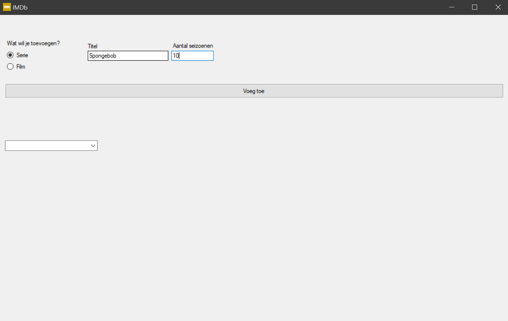

En voor films;

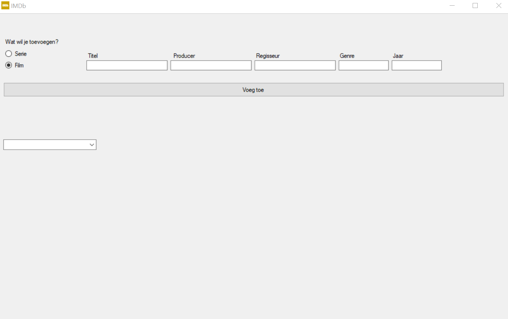

In de designer ziet dat er dan als volgt uit;

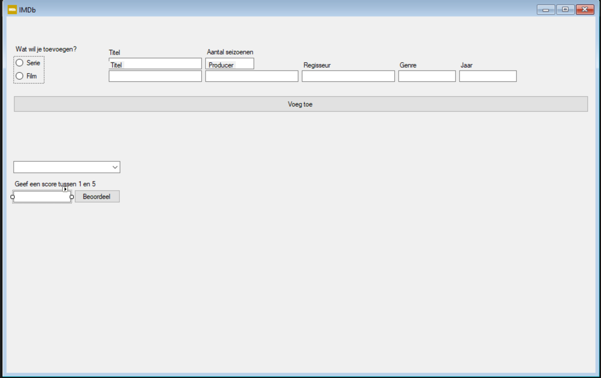

Natuurlijk is er ook code nodig om de zichtbaarheid van elementen aan te passen, deze schrijven we allemaal in de klasse die gelinked is aan onze form. In dit geval de (partial) klasse Imdb.

Nog een bijkomende aanpassing tegenover de Console-versie van deze oefening is dat de gebruiker altijd informatie moet kunnen opvragen over Films & Series. Hiervoor maken we gebruik van een `ComboBox`.

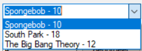

Bovendien moet je een beoordeling kunnen toevoegen aan de geselecteerde Film of Serie

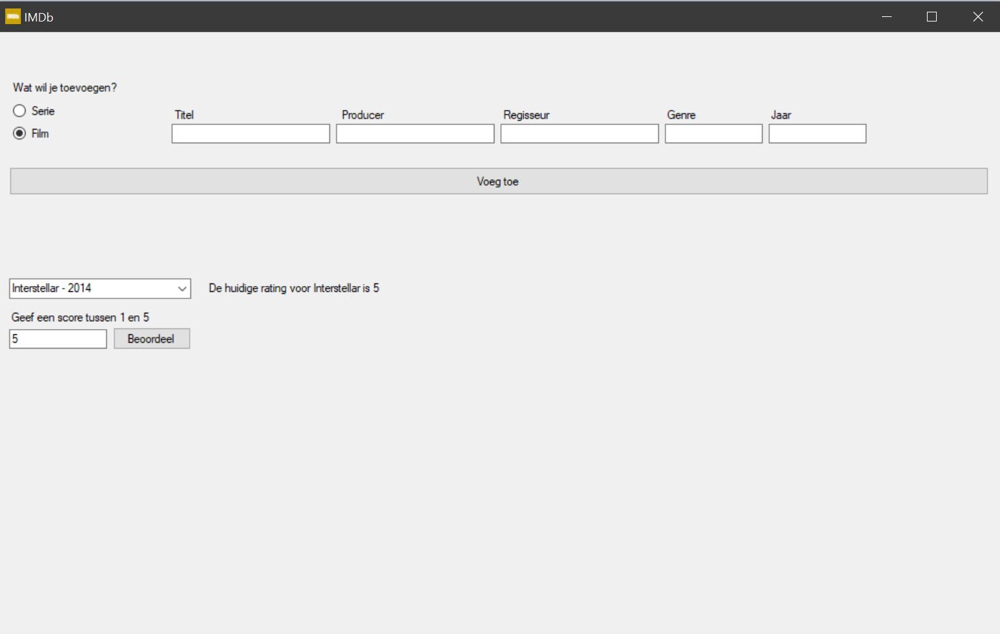

### Klasse Imdb (Form1.cs)
```csharp
public partial class Imdb : Form
    {
        private string rating = "De huidige rating voor {0} is {1}";
        private List<Film> films;
        private List<Serie> series;

        public Imdb()
        {
            InitializeComponent();
            films = new List<Film>();
            series = new List<Serie>();
        }

        private void CheckedChanged(object sender, EventArgs e)
        {
            if (radioButtonFilm.Checked)
            {
                ChangeVisibility(true);
                FilmsUpdaten();
            }
            else
            {
                ChangeVisibility(false);
                SeriesUpdaten();
            }


        }

        private void VoegToe(object sender, EventArgs e)
        {
            if (radioButtonFilm.Checked && IsFilled())
            {
                films.Add(new Film(textBoxFilmTitel.Text, textBoxFilmProducer.Text, textBoxFilmRegisseur.Text, textBoxFilmGenre.Text, int.Parse(textBoxFilmJaar.Text)));
                EmptyTextBoxes();
                FilmsUpdaten();
            }
            else if (IsFilled())
            {
                series.Add(new Serie(textBoxSerieTitel.Text, int.Parse(textBoxSerieSeizoenen.Text)));
                EmptyTextBoxes();
                SeriesUpdaten();
            }
            else
                MessageBox.Show("Niet alle velden zijn gevuld", "Opgelet!", MessageBoxButtons.OK);
        }

        private void KeuzeVeranderd(object sender, EventArgs e)
        {
            if (radioButtonFilm.Checked)
                UpdateFilmRating();
            else
                UpdateSerieRating();
        }

        private bool IsFilled()
        {
            if (radioButtonFilm.Checked)
                return textBoxFilmGenre.Text.Length != 0 && textBoxFilmJaar.Text.Length != 0 && textBoxFilmProducer.Text.Length != 0 && textBoxFilmRegisseur.Text.Length != 0 && textBoxFilmTitel.Text.Length != 0;
            else
                return textBoxSerieSeizoenen.Text.Length != 0 && textBoxSerieTitel.Text.Length != 0;
        }

        private void FilmsUpdaten()
        {
            comboBoxKeuze.DataSource = null;
            comboBoxKeuze.DataSource = films;
        }

        private void SeriesUpdaten()
        {
            comboBoxKeuze.DataSource = null;
            comboBoxKeuze.DataSource = series;
        }

        private void UpdateFilmRating()
        {
            Film keuze = (Film)comboBoxKeuze.SelectedItem;
            try
            {
                labelRating.Text = string.Format(rating, keuze.Titel, keuze.Rating);
                ChangeRatingVisibility(true);
            }
            catch (Exception)
            {
                ChangeRatingVisibility(false);
            }
        }

        private void UpdateSerieRating()
        {
            Serie keuze = (Serie)comboBoxKeuze.SelectedItem;
            try
            {
                labelRating.Text = string.Format(rating, keuze.Titel, keuze.Rating);
                ChangeRatingVisibility(true);
            }
            catch (Exception)
            {
                ChangeRatingVisibility(false);
            }

        }

        private void EmptyTextBoxes()
        {
            foreach (Control control in Controls)//We loopen over elke Control die op onze form staat (een Control is een TextBox, Button, of iets anders waarmee de gebruiker interactie kan hebben)
            {
                if (control is TextBox)//We checken ofdat de Control van het type TextBox is
                    control.ResetText();//We resetten de Text-property naar de standaard waarde (in dit geval leeg)
            }
        }
        /// <summary>
        /// Verandert de zichtbaarheid van de velden voor Film & Serie
        /// </summary>
        /// <param name="film">Op true om film zichtbaar te maken en serie onzichtbaar. False voor het omgekeerde effect</param>
        private void ChangeVisibility(bool film)
        {
            labelFilmGenre.Visible = film;
            labelFilmJaar.Visible = film;
            labelFilmProducer.Visible = film;
            labelFilmRegisseur.Visible = film;
            labelFilmTitel.Visible = film;
            textBoxFilmGenre.Visible = film;
            textBoxFilmJaar.Visible = film;
            textBoxFilmProducer.Visible = film;
            textBoxFilmRegisseur.Visible = film;
            textBoxFilmTitel.Visible = film;

            labelSerieSeizoenen.Visible = !film;
            labelSerieTitel.Visible = !film;
            textBoxSerieSeizoenen.Visible = !film;
            textBoxSerieTitel.Visible = !film;
        }

        /// <summary>
        /// Verander de zichtbaarheid van alle controls die te maken hebben met het toevoegen van een Rating.
        /// </summary>
        /// <param name="visibility">true voor zichtbaar, false voor onzichtbaar</param>
        private void ChangeRatingVisibility(bool visibility)
        {
            labelRating.Visible = visibility;
            labelNieuweRating.Visible = visibility;
            buttonVoegRatingToe.Visible = visibility;
            textBoxRating.Visible = visibility;
        }

        private void ButtonVoegRatingToe_Click(object sender, EventArgs e)
        {
            if (radioButtonFilm.Checked)
            {
                Film keuze = (Film)comboBoxKeuze.SelectedItem;
                keuze.VoegRatingToe(double.Parse(textBoxRating.Text));
                textBoxRating.ResetText();
                labelRating.Text = string.Format(rating, keuze.Titel, keuze.Rating);
            }
            else
            {
                Serie keuze = (Serie)comboBoxKeuze.SelectedItem;
                keuze.VoegRatingToe(double.Parse(textBoxRating.Text));
                textBoxRating.ResetText();
                labelRating.Text = string.Format(rating, keuze.Titel, keuze.Rating);
            }

        }
    }
```
### Klasse Film
```csharp
class Film
    {
        List<double> ratings = new List<double>();
        public string Titel { get; set; }
        public string Producer { get; set; }
        public string Regisseur { get; set; }
        public string Genre { get; set; }
        public int Jaar { get; set; }
        private double rating;

        public double Rating
        {
            get { return rating; }
            set
            {
                if (value <= 5 && value >= 1)
                    rating = value;
                else
                    rating = 2.5;
            }
        }

        public Film(string titel, string producer, string regisseur, string genre, int jaar, double rating)
        {
            Titel = titel;
            Producer = producer;
            Regisseur = regisseur;
            Genre = genre;
            Jaar = jaar;
            Rating = rating;//Zo heeft de default rating geen impact op de ratings die werden ingevoerd door de gebruiker
        }
        public Film(string titel, string producer, string regisseur, string genre, int jaar) : this(titel, producer, regisseur, genre, jaar, 2.5) { }

        public bool VoegRatingToe(double rating)
        {
            if (rating >= 1 && rating <= 5)
            {
                ratings.Add(rating);
                BerekenGemiddelde();
                return true;
            }
            return false;
        }

        public void BerekenGemiddelde()
        {
            Rating = ratings.Average();
        }

        public override string ToString()
        {
            return $"{Titel} - {Jaar}";
        }

    }
```
### Klasse Serie
```csharp
class Serie
    {
        List<double> ratings = new List<double>();
        public string Titel { get; set; }
        public int Seizoenen { get; set; }
        private double rating;

        public double Rating
        {
            get { return rating; }
            set
            {
                if (value <= 5 && value >= 1)
                    rating = value;
                else
                    rating = 2.5;
            }
        }


        public Serie(string titel, int seizoenen, double rating)
        {
            Titel = titel;
            Seizoenen = seizoenen;
            Rating = rating;//Zo heeft de default rating geen impact op de ratings die werden ingevoerd door de gebruiker
        }

        public Serie(string titel, int seizoenen) : this(titel, seizoenen, 2.5) { }

        public bool VoegRatingToe(double rating)
        {
            if (rating >= 1 && rating <= 5)
            {
                ratings.Add(rating);
                BerekenGemiddelde();
                return true;
            }
            return false;
        }

        public void BerekenGemiddelde()
        {
            Rating = ratings.Average();
        }

        public override string ToString()
        {
            return $"{Titel} - {Seizoenen}";
        }

    }
```
Zoals je misschien al hebt gemerkt, zit er enorm veel dubbele code in deze oefening. Dit komt omdat deze oefening gebaseerd is op [oefening 3.1](https://github.com/AP-TI-2018-2019/AP_2018-2019/blob/master/vakken/oop/les3.md), de onderliggende code is (bijna) volledig hetzelfde, met als enige verschil dat er een GUI aan verbonden is. Dit toont nog maar eens het nut van polymorfisme, een begrip dat we nog niet kenden in les 3, aan.
## Oefening 5.3 - Extra
Een leuke extra die je kan maken is een affiche van de film tonen aan de hand van de titel, door een zoekopdracht te maken en de eerste afbeelding te nemen. Ik heb ervoor gekozen om gebruik te maken van de API van duckduckgo (een alternatief voor google, want google vereist een API-key en limiteert het aantal verzoeken per dag tot 100). Het enige wat je moet doen is een extra pictureBox maken en de code in de Imdb-klasse (Form1.cs) aanpassen. Al de andere klasses blijven gewoon hetzelfde.

Om te begrijpen hoe dit allemaal werkt is het belangrijk dat je eerst weet hoe JSON werkt. [Hier](https://developer.mozilla.org/en-US/docs/Learn/JavaScript/Objects/JSON) is een goede uitleg.
### Klasse Imdb (Form1.cs)
```csharp
public partial class Imdb : Form
    {
        private string rating = "De huidige rating voor {0} is {1}";
        private List<Film> films;
        private List<Serie> series;

        public Imdb()
        {
            InitializeComponent();
            films = new List<Film>();
            series = new List<Serie>();
        }

        private void CheckedChanged(object sender, EventArgs e)
        {
            if (radioButtonFilm.Checked)
            {
                ChangeVisibility(true);
                FilmsUpdaten();
            }
            else
            {
                ChangeVisibility(false);
                SeriesUpdaten();
            }


        }

        private void VoegToe(object sender, EventArgs e)
        {
            if (radioButtonFilm.Checked && IsFilled())
            {
                films.Add(new Film(textBoxFilmTitel.Text, textBoxFilmProducer.Text, textBoxFilmRegisseur.Text, textBoxFilmGenre.Text, int.Parse(textBoxFilmJaar.Text)));
                EmptyTextBoxes();
                FilmsUpdaten();
            }
            else if (IsFilled())
            {
                series.Add(new Serie(textBoxSerieTitel.Text, int.Parse(textBoxSerieSeizoenen.Text)));
                EmptyTextBoxes();
                SeriesUpdaten();
            }
            else
                MessageBox.Show("Niet alle velden zijn gevuld", "Opgelet!", MessageBoxButtons.OK);
        }

        private void KeuzeVeranderd(object sender, EventArgs e)
        {
            if (radioButtonFilm.Checked)
                UpdateFilmRating();
            else
                UpdateSerieRating();
        }

        private bool IsFilled()
        {
            if (radioButtonFilm.Checked)
                return textBoxFilmGenre.Text.Length != 0 && textBoxFilmJaar.Text.Length != 0 && textBoxFilmProducer.Text.Length != 0 && textBoxFilmRegisseur.Text.Length != 0 && textBoxFilmTitel.Text.Length != 0;
            else
                return textBoxSerieSeizoenen.Text.Length != 0 && textBoxSerieTitel.Text.Length != 0;
        }

        private void FilmsUpdaten()
        {
            comboBoxKeuze.DataSource = null;
            comboBoxKeuze.DataSource = films;
        }

        private void SeriesUpdaten()
        {
            comboBoxKeuze.DataSource = null;
            comboBoxKeuze.DataSource = series;
        }

        private void UpdateFilmRating()
        {
            Film keuze = (Film)comboBoxKeuze.SelectedItem;
            try
            {
                labelRating.Text = string.Format(rating, keuze.Titel, keuze.Rating);
                ChangeRatingVisibility(true);
                try
                {
                    string result;
                    using (WebClient client = new WebClient())
                    {
                        result = client.DownloadString("https://api.duckduckgo.com/?q=" + keuze.Titel + "&format=json&pretty=1");
                    }
                    dynamic search = JsonConvert.DeserializeObject(result);
                    string url = search.RelatedTopics[0].Icon.URL;
                    pictureBox1.Load(url);
                }
                catch (System.InvalidOperationException)
                {
                    labelRating.Text = labelRating.Text + "      |      Geen afbeelding gevonden :(";
                }
                catch (Exception)
                {
                    labelRating.Text = labelRating.Text + "      |      Er is iets fout gegaan tijdens het ophalen van de afbeelding.";
                }
            }
            catch (Exception)
            {
                ChangeRatingVisibility(false);
            }
        }

        private void UpdateSerieRating()
        {
            Serie keuze = (Serie)comboBoxKeuze.SelectedItem;
            try
            {
                labelRating.Text = string.Format(rating, keuze.Titel, keuze.Rating);
                ChangeRatingVisibility(true);
            }
            catch (Exception)
            {
                ChangeRatingVisibility(false);
            }

        }

        private void EmptyTextBoxes()
        {
            foreach (Control control in Controls)//We loopen over elke Control die op onze form staat (een Control is een TextBox, Button, of iets anders waarmee de gebruiker interactie kan hebben)
            {
                if (control is TextBox)//We checken ofdat de Control van het type TextBox is
                    control.ResetText();//We resetten de Text-property naar de standaard waarde (in dit geval leeg)
            }
        }
        /// <summary>
        /// Verandert de zichtbaarheid van de velden voor Film & Serie
        /// </summary>
        /// <param name="film">Op true om film zichtbaar te maken en serie onzichtbaar. False voor het omgekeerde effect</param>
        private void ChangeVisibility(bool film)
        {
            labelFilmGenre.Visible = film;
            labelFilmJaar.Visible = film;
            labelFilmProducer.Visible = film;
            labelFilmRegisseur.Visible = film;
            labelFilmTitel.Visible = film;
            textBoxFilmGenre.Visible = film;
            textBoxFilmJaar.Visible = film;
            textBoxFilmProducer.Visible = film;
            textBoxFilmRegisseur.Visible = film;
            textBoxFilmTitel.Visible = film;

            labelSerieSeizoenen.Visible = !film;
            labelSerieTitel.Visible = !film;
            textBoxSerieSeizoenen.Visible = !film;
            textBoxSerieTitel.Visible = !film;
        }

        /// <summary>
        /// Verander de zichtbaarheid van alle controls die te maken hebben met het toevoegen van een Rating.
        /// </summary>
        /// <param name="visibility">true voor zichtbaar, false voor onzichtbaar</param>
        private void ChangeRatingVisibility(bool visibility)
        {
            labelRating.Visible = visibility;
            labelNieuweRating.Visible = visibility;
            buttonVoegRatingToe.Visible = visibility;
            textBoxRating.Visible = visibility;
        }

        private void ButtonVoegRatingToe_Click(object sender, EventArgs e)
        {
            if (radioButtonFilm.Checked)
            {
                Film keuze = (Film)comboBoxKeuze.SelectedItem;
                keuze.VoegRatingToe(double.Parse(textBoxRating.Text));
                textBoxRating.ResetText();
                labelRating.Text = string.Format(rating, keuze.Titel, keuze.Rating);
            }
            else
            {
                Serie keuze = (Serie)comboBoxKeuze.SelectedItem;
                keuze.VoegRatingToe(double.Parse(textBoxRating.Text));
                textBoxRating.ResetText();
                labelRating.Text = string.Format(rating, keuze.Titel, keuze.Rating);
            }

        }
    }
```
Deze code gaat niet meteen werken, omdat je nog referenties mist. Om dit op te lossen klik je rechts op `References` en vervolgens op `Add Reference`.

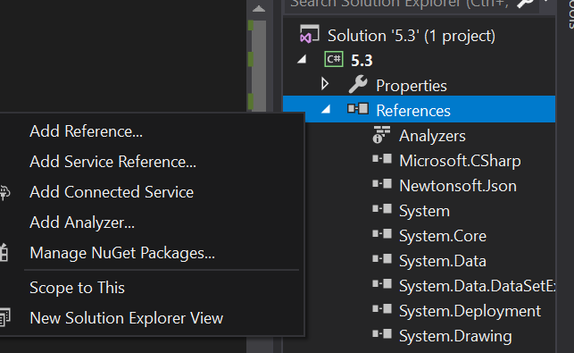

Daarna type je in de zoekbalk 'json' en voeg je `JSON.NET` toe.

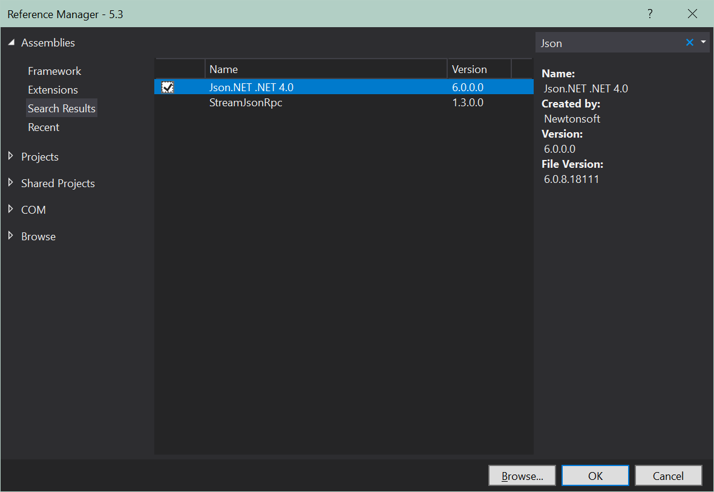

En tot slot ga je op het rode lijntje staan, druk je op `Alt` + `Enter`, en nogmaals enter om `using Newtonsoft.Json;` vanboven toe te voegen.


Uiteindelijk zou je dit als resultaat moeten krijgen;

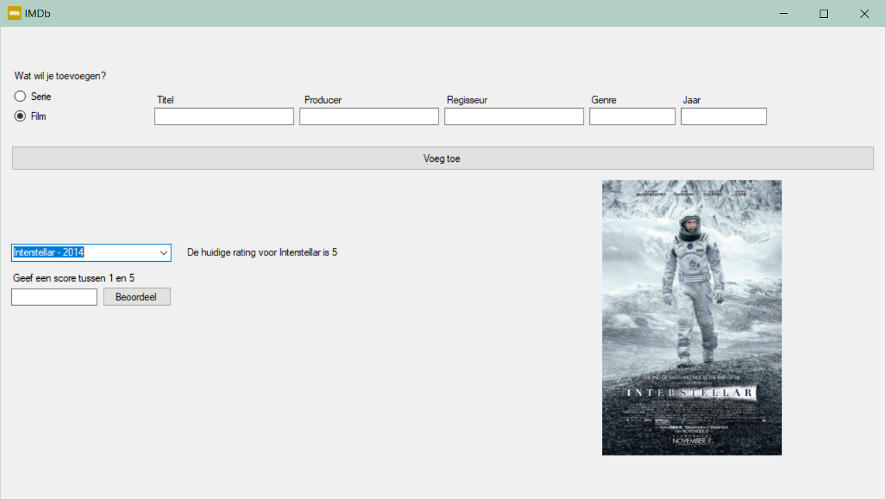
## Oefening 5.4
Net zoals in de vorige oefening moeten we de zichtbaarheid van bepaalde `Control`s aanpassen afhankelijk van wat de gebruiker wilt doen. Het hoofdscherm zou er ongeveer zo moeten uitzien;

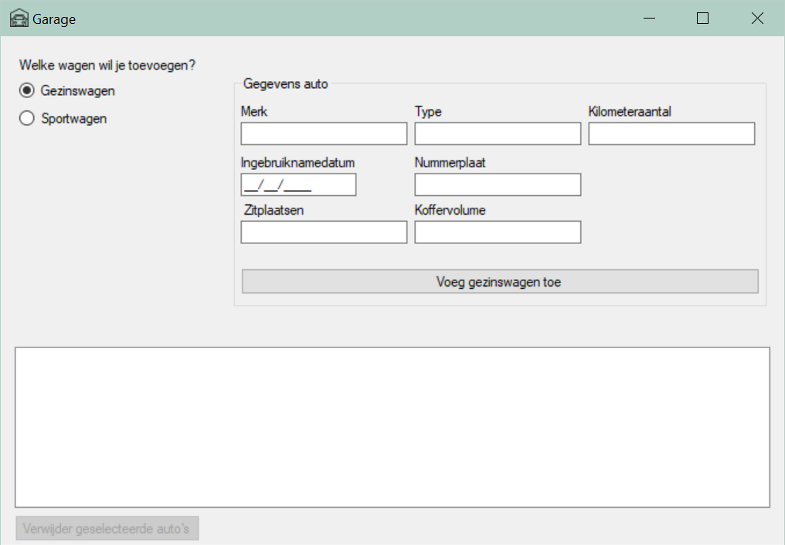

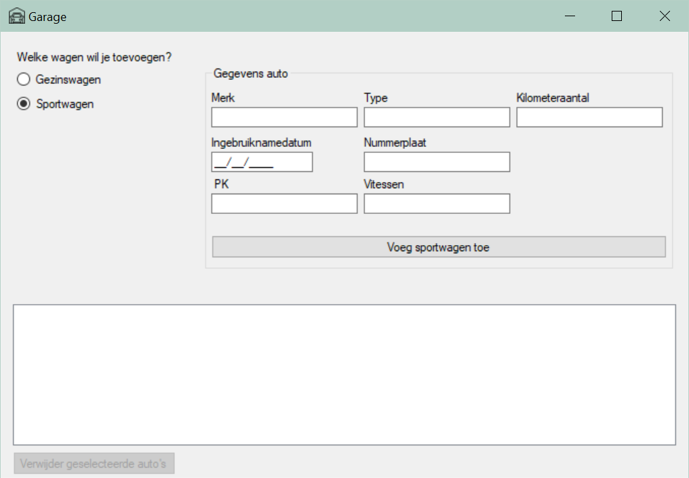

Het is je waarschijnlijk al opgevallen dat een aantal velden van naam veranderen afhankelijk van welke soort auto de gebruiker wilt toevoegen. In dit geval gaat het over de velden voor zitplaatsen, koffervolume, pk en vitessen. Je zou 1 label en 1 textbox kunnen maken voor zowel zitplaatsen & pk als koffervolume & vitessen, en dan enkel de `Text`-property van de labels aanpassen. Echter heb ik om het simpel en overzichtelijk te houden ervoor gekozen om effectief verschillende velden te gebruiken en hiervan dan de zichtbaarheid aan te passen, zo zien we in de code ook duidelijk welke gegevens we uit de TextBoxes halen. Omdat het programma opstart met Gezinswagen geselecteerd, zorgen we ervoor dat enkel de velden die voor een gezinswagen dienen zichtbaar zijn; we zetten de `Visible` property bij labelPk, textBoxPk, labelVitessen en textBoxVitessen op 'false'. Merk ook op dat 1 van de `TextBox`es geen normale `TextBox` is, maar wel een `MaskedTextBox`, zodat de gebruiker enkel een datum kan meegeven.

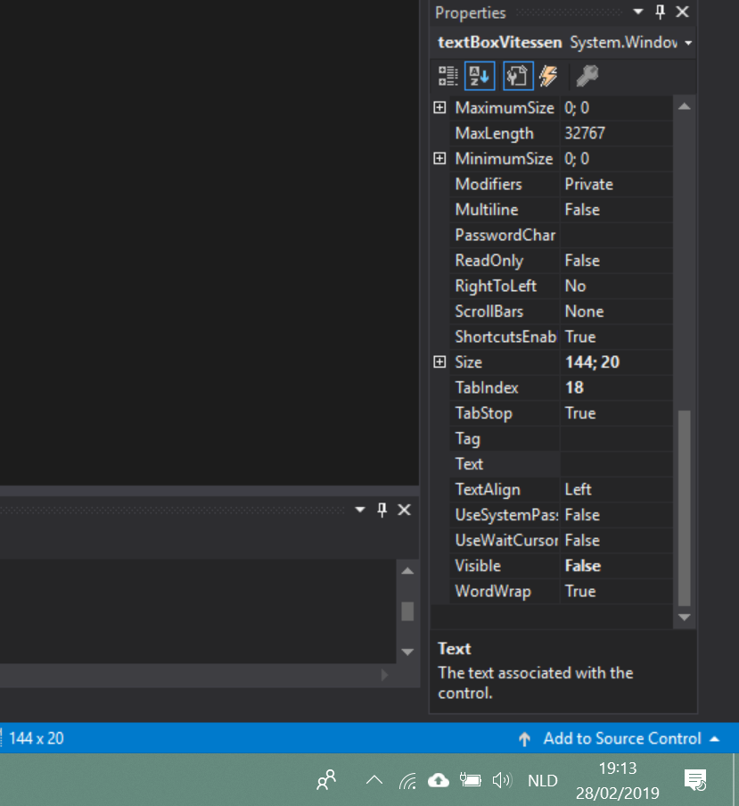

Eens alles is aangemaakt, zou het er in de designer als volgt moeten uitzien;

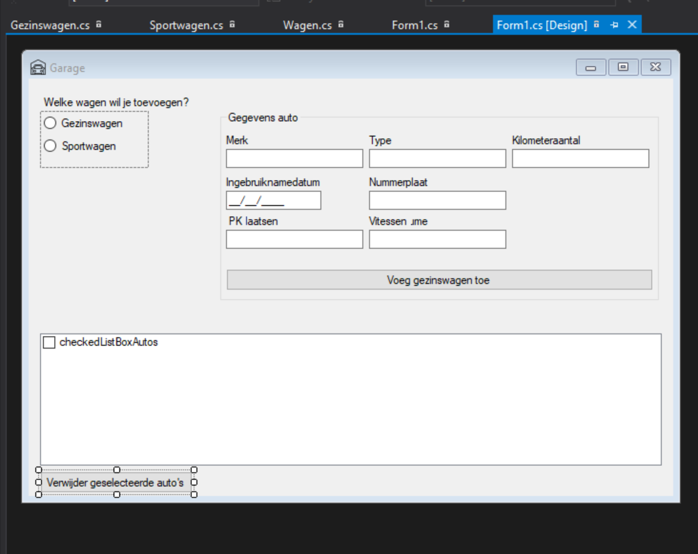

Werking van het programma:
Je kan auto's toevoegen door alle velden in te vullen en vervolgens op 'Voeg gezinswagen/sportwagen toe' te klikken

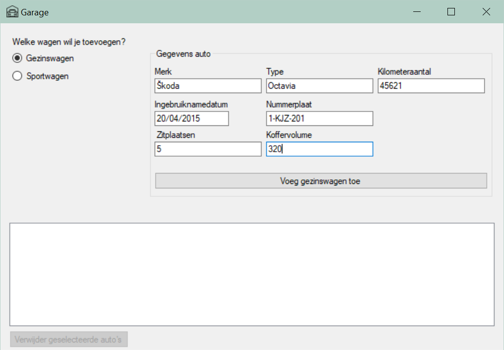

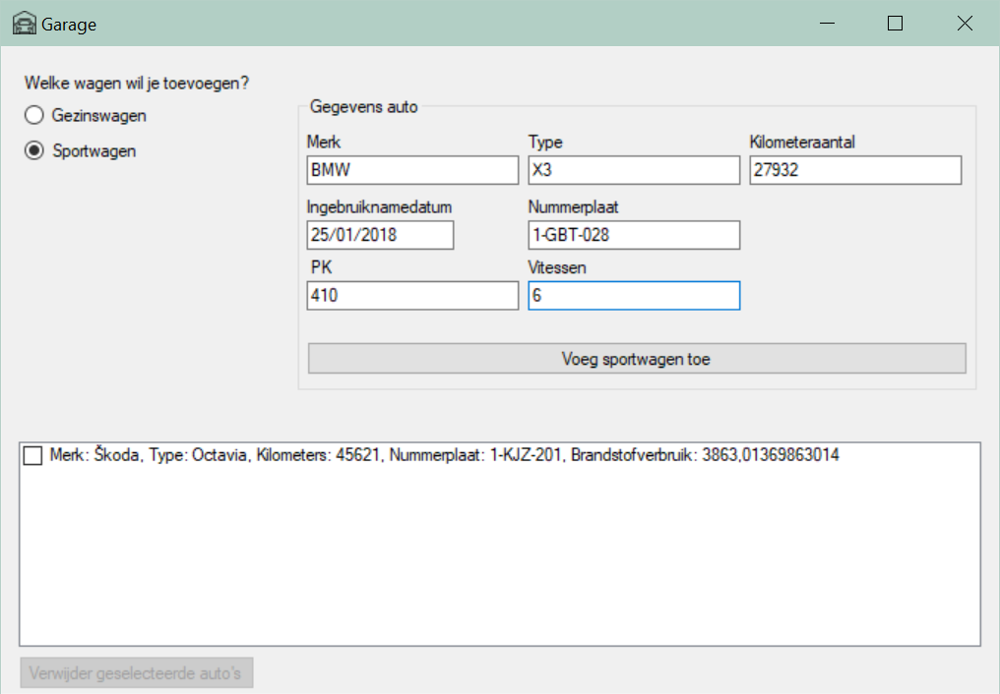

Deze auto's worden dan aan een `List` toegevoegd en aan de gebruiker getoond via een CheckedListBox

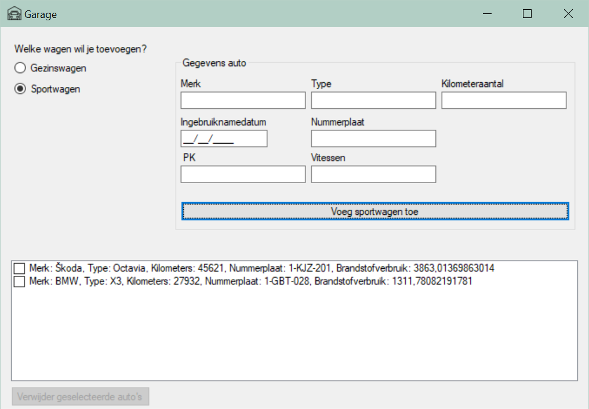

Indien je een auto uit de lijst selecteert, wordt de verwijder-knop aangezet.

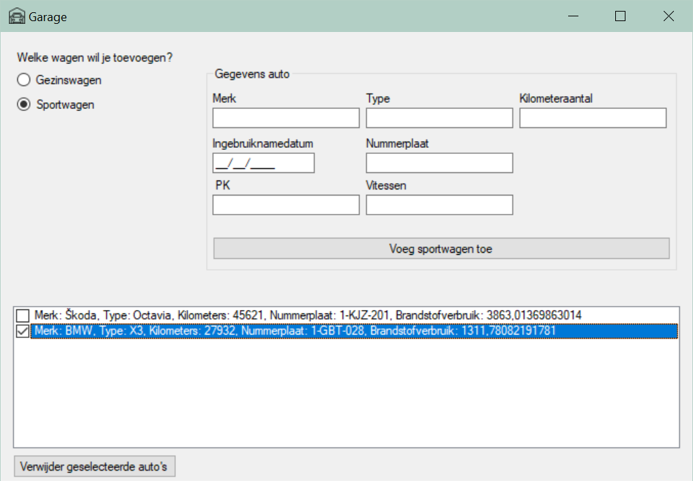

En door op de verwijder-knop te drukken wordt de auto uiteraard uit de lijst verwijderd.

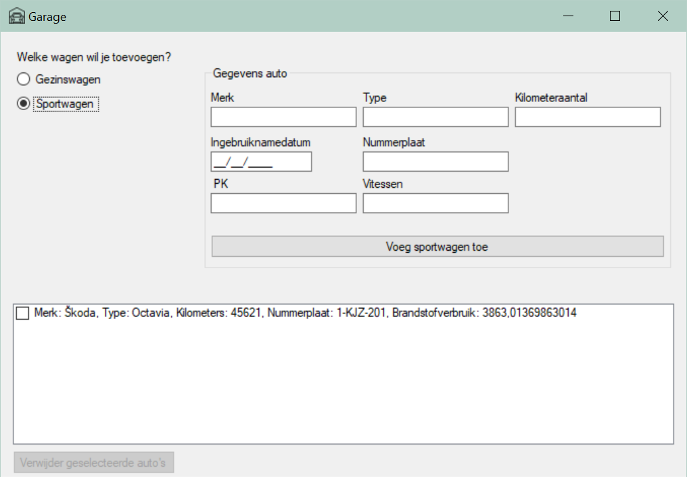

Oké, tijd voor de code die alles laat werken.

### Klasse Garage (Form1.cs)
```csharp
public partial class Garage : Form
{
    private List<Wagen> autoLijst;
    public Garage()
    {
        InitializeComponent();
        autoLijst = new List<Wagen>();
    }

    private void CheckedChanged(object sender, EventArgs e)
    {
        if (IsGezin())
            ChangeVisibility(false, true);
        else
            ChangeVisibility(true, false);
    }

    private void ButtonToevoegen_Click(object sender, EventArgs e)
    {
        if (IsGezin())
            VoegWagenToe(new Gezinswagen(textBoxMerk.Text, textBoxType.Text, int.Parse(textBoxKilometers.Text), DateTime.Parse(maskedTextBoxIngebruiknamedatum.Text), textBoxNummerplaat.Text, int.Parse(textBoxKoffervolume.Text), int.Parse(textBoxZitplaatsen.Text)));
        else
            VoegWagenToe(new Sportwagen(textBoxMerk.Text, textBoxType.Text, int.Parse(textBoxKilometers.Text), DateTime.Parse(maskedTextBoxIngebruiknamedatum.Text), textBoxNummerplaat.Text, int.Parse(textBoxPk.Text), int.Parse(textBoxVitessen.Text)));
    }

    private void VoegWagenToe(Wagen wagen)
    {
        autoLijst.Add(wagen);
        VulListBox();
        foreach (Control c in groupBoxAutoGegevens.Controls)
            if (c is TextBox || c is MaskedTextBox)
                c.Text = "";
    }

    private void VulListBox()
    {
        checkedListBoxAutos.Items.Clear();
        foreach (Wagen wagen in autoLijst)
            checkedListBoxAutos.Items.Add(wagen);
    }

    private void ChangeVisibility(bool sport, bool gezin)
    {
        labelVitessen.Visible = sport;
        textBoxVitessen.Visible = sport;
        labelPk.Visible = sport;
        textBoxPk.Visible = sport;

        labelKoffervolume.Visible = gezin;
        textBoxKoffervolume.Visible = gezin;
        labelZitplaatsen.Visible = gezin;
        textBoxZitplaatsen.Visible = gezin;

        if (gezin)
            buttonToevoegen.Text = "Voeg gezinswagen toe";
        else
            buttonToevoegen.Text = "Voeg sportwagen toe";
    }

    public bool IsGezin()
    {
        return radioButtonGezinswagen.Checked;
    }

    private void ButtonVerwijder_Click(object sender, EventArgs e)
    {
        foreach (Wagen wagen in checkedListBoxAutos.CheckedItems)
            autoLijst.Remove(wagen);
        VulListBox();
        buttonVerwijder.Enabled = false;
    }

    private void ItemCheck(object sender, ItemCheckEventArgs e)
    {
        buttonVerwijder.Enabled = true;
    }
}
```
### Klasse Wagen
```csharp
internal class Wagen
    {
        protected const int VERBRUIK = 5;
        public string Merk { get; set; }
        public string Type { get; set; }
        public int Kilometers { get; set; }
        private DateTime ingebruiknamedatum;

        public DateTime Ingebruiknamedatum
        {
            get { return ingebruiknamedatum; }
            set
            {
                if (value >= new DateTime(1886, 1, 1) && value <= DateTime.Today)
                    ingebruiknamedatum = value;
            }
        }

        private string nummerplaat;

        public string Nummerplaat
        {
            get { return nummerplaat; }
            set
            {
                if (value.Length >= 1 && value.Length <= 9)
                    nummerplaat = value;
                else
                    nummerplaat = "1-AAA-000";
            }
        }

        public Wagen(string merk, string type, int kilometers, DateTime ingebruiknamedatum, string nummerplaat)
        {
            Merk = merk;
            Type = type;
            Kilometers = kilometers;
            Ingebruiknamedatum = ingebruiknamedatum;
            Nummerplaat = nummerplaat;
        }

        public virtual double BerekenBrandstofVerbruik()
        {
            return (VERBRUIK / 100.0) * (20000 * ((DateTime.Today - Ingebruiknamedatum).Days / 365.0));
        }

        public override string ToString()
        {
            return $"Merk: {Merk}, Type: {Type}, Kilometers: {Kilometers}, Nummerplaat: {Nummerplaat}, Brandstofverbruik: {BerekenBrandstofVerbruik()}\n";
        }
    }
```
### Klasse Gezinswagen
```csharp
internal class Gezinswagen : Wagen
{
    private const double EXTRA_VERBRUIK = 1.1;
    public int Koffervolume { get; set; }
    private int zitPlaatsen;

    public int ZitPlaatsen
    {
        get { return zitPlaatsen; }
        set
        {
            if (value >= 4 && value <= 7)
                zitPlaatsen = value;
            else
                zitPlaatsen = 5;
        }
    }

    public Gezinswagen(string merk, string type, int kilometers, DateTime ingebruiknamedatum, string nummerplaat, int kofferVolume, int zitPlaatsen) : base(merk, type, kilometers, ingebruiknamedatum, nummerplaat)
    {
        Koffervolume = kofferVolume;
        ZitPlaatsen = zitPlaatsen;
    }

    public override double BerekenBrandstofVerbruik()
    {
        if (ZitPlaatsen == 7)
            return base.BerekenBrandstofVerbruik() * EXTRA_VERBRUIK;
        return base.BerekenBrandstofVerbruik();
    }

    public override string ToString()
    {
        return base.ToString() + $"Zitplaatsen: {ZitPlaatsen}, Koffervolume: {Koffervolume}";
    }
}
```
### Klasse Sportwagen
```csharp
class Sportwagen : Wagen
{
    private const double EXTRA_VERBRUIK = 1.2;
    public int PK { get; set; }
    private int aantalVitessen;

    public int AantalVitessen
    {
        get { return aantalVitessen; }
        set
        {
            if (value <= 6 && value >= 1)
                aantalVitessen = value;
            else
                aantalVitessen = 5;
        }
    }


    public Sportwagen(string merk, string type, int kilometers, DateTime ingebruiknamedatum, string nummerplaat, int pk, int aantalVitessen) : base(merk, type, kilometers, ingebruiknamedatum, nummerplaat)
    {
        PK = pk;
        AantalVitessen = aantalVitessen;
    }

    public override double BerekenBrandstofVerbruik()
    {
        if (AantalVitessen == 6)
            return base.BerekenBrandstofVerbruik() * EXTRA_VERBRUIK;
        return base.BerekenBrandstofVerbruik();
    }

    public override string ToString()
    {
        return base.ToString() + $"PK: {PK}, Aantal vitessen: {AantalVitessen}";
    }
}
```
