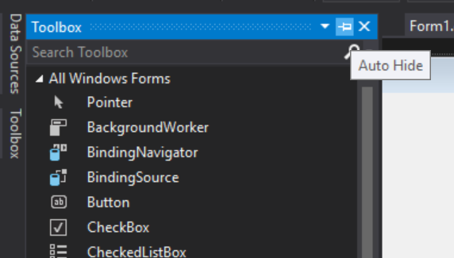
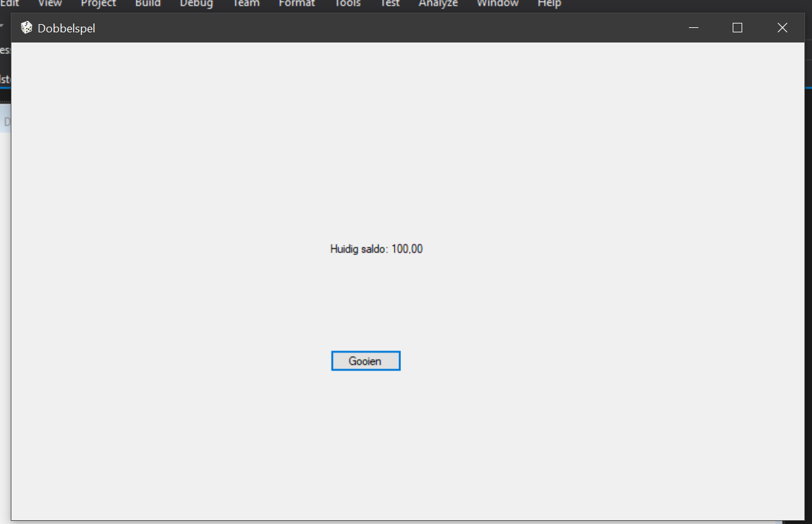
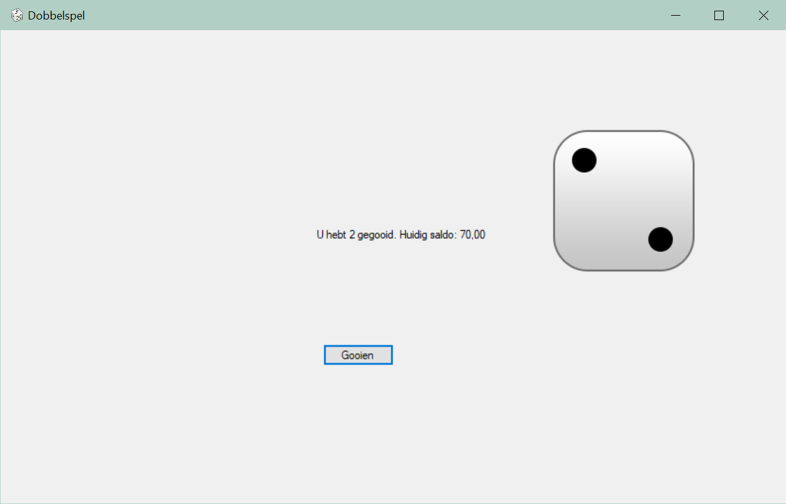
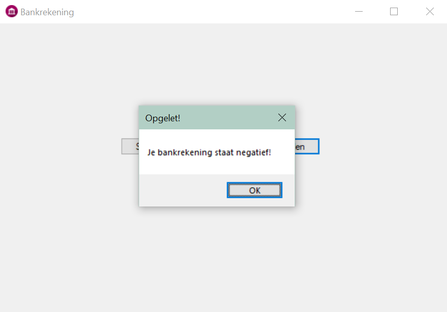

# Les 5
## Oefening 5.1
Om te beginnen; zorg ervoor dat je Toolbox zichtbaar is. Standaard is dit niet het geval, zoals in onderstaand screenshot


Om de Toolbox te openen, maak je gebruik van de sneltoets `ctrl` + `alt` + `x`.
Je kan deze dan ook vastpinnen door op de pinknop te drukken.



Sleep nu een Button uit de Toolbox naar de Form. Eens dit gebeurd is kan je de naam en andere eigenschappen ervan aanpassen. Dit doe je rechtsonder;


De tekst die op de knop zelf staat kan je aanpassen als je naar onder scrollt, en zoekt achter de property `Text`.

Sleep nu ook een Label vanuit de Toolbox naar de Form en pas hiervan ook de naam aan. Maak ook de `Text`-property leeg.

Als je het programma start, zou dat er ongeveer zo moeten uitzien;



Maar dan zonder het Saldo, want de code daarvoor moeten we nog aanmaken.

#### De code
### Klasse Program
Hebben we voor het eerst gewoon standaard gelaten.
### Klasse Dobbelspel (Form1.cs)
Opgelet: dit is enkel het code-deel van de klasse (daarvan partial class). Het design-deel wordt automatisch aangemaakt door Visual Studio en daar blijven we af.
```csharp
public partial class Dobbelspel : Form
    {
        private const decimal START_GELD = 100.00m;
        private Geld geld = new Geld(START_GELD);
        private Dobbelsteen dobbelsteen = new Dobbelsteen();
        public Dobbelspel()
        {
            InitializeComponent();
            labelSaldo.Text = geld.ToString();//Om een reden moet ik dit converteren ondanks dat er een ToString()-methode is overridden in de klasse Geld.
        }

        private void KnopGooi_Click(object sender, EventArgs e)
        {
            int worp = dobbelsteen.Gooi();
            if (geld.PasSaldoAan(worp) && geld.Saldo != 0)
                labelSaldo.Text = $"U hebt {worp} gegooid. {geld.ToString()}";
            else
            {
                labelSaldo.Text = "Geld is op.";
                KnopGooi.Enabled = false;
            }

        }
    }
```
### Klasse Geld
```csharp
internal class Geld
    {
        public decimal Saldo { get; set; }

        public Geld(decimal saldo)
        {
            Saldo = saldo;
        }

        public bool PasSaldoAan(int aantal)
        {
            decimal aanpassing;
            switch (aantal)
            {
                case 1:
                    aanpassing = 20;
                    break;
                case 6:
                    aanpassing = 15;
                    break;
                default:
                    aanpassing = -10;
                    break;
            }
            if (Saldo + aanpassing < 0)
                return false;
            Saldo += aanpassing;
            return true;
        }

        public override string ToString()
        {
            return $"Huidig saldo: {Saldo}";
        }
    }
```
### Klasse Dobbelsteen
```csharp
class Dobbelsteen
    {
        Random random = new Random();
        public int Gooi()
        {
            return random.Next(1, 7);
        }
    }
```
Het uiteindelijke resultaat zou er ongeveer zo moeten uitzien;



## Oefening 5.2
Maak gebruik van Knoppen, Een Textbox en een Label om het programma er als volgt uit te laten zien;


### Klasse Bank (Form1.cs)
```csharp
public partial class Bank : Form
    {
        Bankrekening bankrekening = new Bankrekening(100.00m);
        public Bank()
        {
            InitializeComponent();
            UpdateSaldo();
        }


        private void KnopStorten_Click(object sender, EventArgs e)
        {
            bankrekening.WijzigSaldo(decimal.Parse(textBoxHoeveelheid.Text));
            UpdateSaldo();
        }

        private void KnopAfhalen_Click(object sender, EventArgs e)
        {
            bankrekening.WijzigSaldo(-decimal.Parse(textBoxHoeveelheid.Text));
            UpdateSaldo();
        }

        private void UpdateSaldo()
        {
            if (bankrekening.Saldo < 0)
            {
                labelSaldo.ForeColor = Color.Red;
                MessageBox.Show("Je bankrekenign staat negatief!", "Opgelet!", MessageBoxButtons.OK);
            }

            else
                labelSaldo.ForeColor = Color.Black;
            labelSaldo.Text = bankrekening.ToString();//Iemand die weet waarom ik hier .ToString() moet doen? Pls leg uit thanks
        }
    }
```
De `MessageBox` zorgt ervoor dat er een melding wordt getoond aan de gebruiker als zijn bankrekening negatief staat. Het zou er ongeveer zo moeten uitzien;

### Klasse Bankrekening
```csharp
class Bankrekening
    {
        public decimal Saldo { get; private set; }
        public Bankrekening(decimal saldo)
        {
            Saldo = saldo;
        }

        public void WijzigSaldo(decimal hoeveelheid)
        {
            Saldo += hoeveelheid;
        }

        public override string ToString()
        {
            return $"Huidig saldo: {Saldo}";
        }
    }
```
