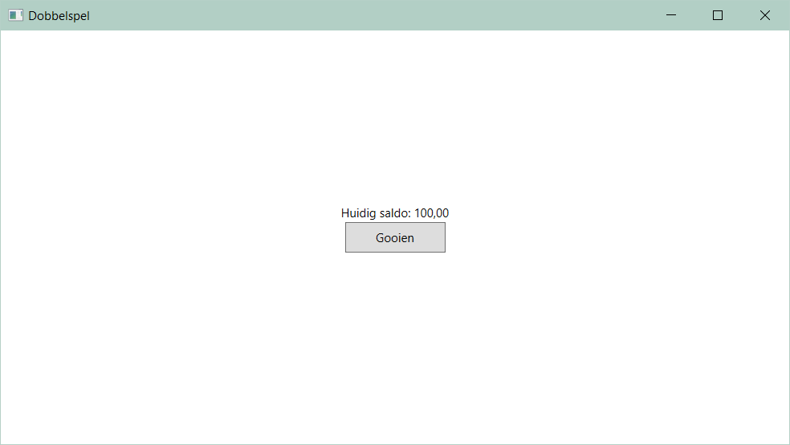
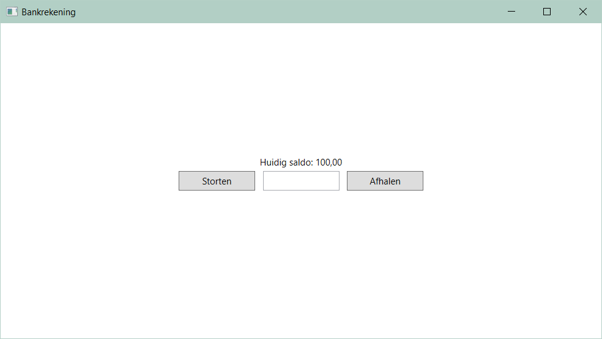

# Les 5 | WPF
De oefeningen van les 5, maar dan met WPF in plaats van Windows Forms. Dit is geen leerstof.

Het voordeel van WPF tegenover Windows Forms is dat je de layout in xaml maakt. Dit geeft meer controle over waar wat staat, biedt schaalvoordelen en daardoor ziet alles er gewoon veel "cleaner" uit. Ook kan ik hier makkelijk de het design bijvoegen omdat de code veel simpeler is en overal werkt.
## Oefening 5.1



### Het design (MainWindow.xaml)
```xml
<Window x:Class="WpfApp1_5._1.MainWindow"
        xmlns="http://schemas.microsoft.com/winfx/2006/xaml/presentation"
        xmlns:x="http://schemas.microsoft.com/winfx/2006/xaml"
        xmlns:d="http://schemas.microsoft.com/expression/blend/2008"
        xmlns:mc="http://schemas.openxmlformats.org/markup-compatibility/2006"
        xmlns:local="clr-namespace:WpfApp1_5._1"
        mc:Ignorable="d"
        Title="Dobbelspel" Height="450" Width="800">
    <Grid>
        <Label Content="{Binding LabelText}" Name="labelSaldo" HorizontalAlignment="Center" VerticalAlignment="Center" Margin="0,0,0,50"/>
        <Button
             Height="30px" Width="100px" Click="Gooien" Name="knopGooi">
            Gooien
        </Button>
    </Grid>
</Window>
```

### Klasse MainWindow (MainWindow.xaml.cs)
```csharp
public partial class MainWindow : Window
   {
       private const decimal START_GELD = 100.00m;
       private Geld geld = new Geld(START_GELD);
       private Dobbelsteen dobbelsteen = new Dobbelsteen();
       public MainWindow()
       {
           InitializeComponent();
           labelSaldo.Content = geld;
       }

       private void Gooien(object sender, RoutedEventArgs e)
       {
           int worp = dobbelsteen.Gooi();
           if (geld.PasSaldoAan(worp) && geld.Saldo != 0)
               labelSaldo.Content = $"U hebt {worp} gegooid. {geld.ToString()}";
           else
           {
               labelSaldo.Content = "Geld is op.";
               knopGooi.IsEnabled = false;
           }
       }
   }
```
### Klasse Geld
```csharp
internal class Geld
    {
        public decimal Saldo { get; set; }

        public Geld(decimal saldo)
        {
            Saldo = saldo;
        }

        public bool PasSaldoAan(int aantal)
        {
            decimal aanpassing;
            switch (aantal)
            {
                case 1:
                    aanpassing = 20;
                    break;
                case 6:
                    aanpassing = 15;
                    break;
                default:
                    aanpassing = -10;
                    break;
            }
            if (Saldo + aanpassing < 0)
                return false;
            Saldo += aanpassing;
            return true;
        }

        public override string ToString()
        {
            return $"Huidig saldo: {Saldo}";
        }
    }
```
### Klasse Dobbelsteen
```csharp
class Dobbelsteen
    {
        Random random = new Random();
        public int Gooi()
        {
            return random.Next(1, 7);
        }
    }
```
## Oefening 5.2



### Het Design (MainWindow.xaml)
```xml
<Window x:Class="WpfApp1_5._2.MainWindow"
        xmlns="http://schemas.microsoft.com/winfx/2006/xaml/presentation"
        xmlns:x="http://schemas.microsoft.com/winfx/2006/xaml"
        xmlns:d="http://schemas.microsoft.com/expression/blend/2008"
        xmlns:mc="http://schemas.openxmlformats.org/markup-compatibility/2006"
        xmlns:local="clr-namespace:WpfApp1_5._2"
        mc:Ignorable="d"
        Title="Bankrekening" Height="450" Width="800">
    <Grid>
        <Label Name="labelSaldo" HorizontalAlignment="Center" VerticalAlignment="Center" Margin="0,0,0,50"></Label>
        <StackPanel Orientation="Horizontal" HorizontalAlignment="Center">
            <Button Width="100px" Height="25px" Click="Storten">Storten</Button>
            <TextBox Width="100px" Height="25px" Margin="10,0,0,0" Name="textBoxHoeveelheid"></TextBox>
            <Button Width="100px" Height="25px" Margin="10,0,0,0" Click="Afhalen">Afhalen</Button>
        </StackPanel>
    </Grid>
</Window>
```
### Klasse MainWindow
```csharp
public partial class MainWindow : Window
    {
        Bankrekening bankrekening = new Bankrekening(100.00m);
        public MainWindow()
        {
            InitializeComponent();
            UpdateSaldo();
        }

        private void Storten(object sender, RoutedEventArgs e)
        {
            bankrekening.WijzigSaldo(decimal.Parse(textBoxHoeveelheid.Text));
            UpdateSaldo();
        }

        private void Afhalen(object sender, RoutedEventArgs e)
        {
            bankrekening.WijzigSaldo(-decimal.Parse(textBoxHoeveelheid.Text));
            UpdateSaldo();
        }

        private void UpdateSaldo()
        {
            if (bankrekening.Saldo < 0)
            {
                labelSaldo.Foreground = Brushes.Red;
                MessageBox.Show("Je bankrekening staat negatief!", "Opgelet!", MessageBoxButton.OK);
            }

            else
                labelSaldo.Foreground = Brushes.Black;
            labelSaldo.Content = bankrekening.ToString();//Iemand die weet waarom ik hier .ToString() moet doen? Pls leg uit thanks
        }
    }
```
### Klasse Bankrekening
```csharp
class Bankrekening
    {
        public decimal Saldo { get; private set; }
        public Bankrekening(decimal saldo)
        {
            Saldo = saldo;
        }

        public void WijzigSaldo(decimal hoeveelheid)
        {
            Saldo += hoeveelheid;
        }

        public override string ToString()
        {
            return $"Huidig saldo: {Saldo}";
        }
    }
```
