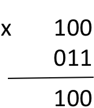
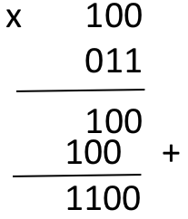

# Binair vermenigvuldigen
In dit voorbeeld vermenigvuldigen we 4 met 3, in binair 100 met 011.

We starten van rechts naar links vanaf het tweede getal (011). We nemen dus de 1 helemaal rechts van 011 en vermenigvuldigen dit met het eerste getal (100). 1 * 100 is 100.

We doen exact hetzelfde voor de tweede bit van het tweede getal en verkrijgen opnieuw 100. We plaatsen dit resultaat wel 1 bit naar links.

Omdat de derde bit van ons tweede getal gelijk is aan 0, slagen we dit over (0 * 100 = 0) en kunnen we meteen starten aan het [optellen](binair_optellen.md) van onze tussenresultaten.

In het geval dat we met kommagetallen werken, tellen we de het aantal bits achter de komma vanaf de minst beduidende bit bij beide getallen op.
Stel dat we 100,(01 <-- 2 bits achter de komma tot en met de lsb(least significant bit, of laatste 1)) en 11,(1 <-- 1 bit achter de komma tot en met de lsb) optellen geeft dat dat we in ons uiteindelijk resultaat 3 beduidende bits (2+1) achter de komma gaan hebben.

          1 0 0, 0 1
            1 1, 1
      x
      1 0 0 0 1       <-- 1 * 10001
    1 0 0 0 1         <-- 1 * 10001
  1 0 0 0 1           <-- 1 * 10001
+
  1 1 1 0 1 1 1

  Toevoeging komma 3 bits vanaf de lsb:

  1 1 1 0,1 1 1
